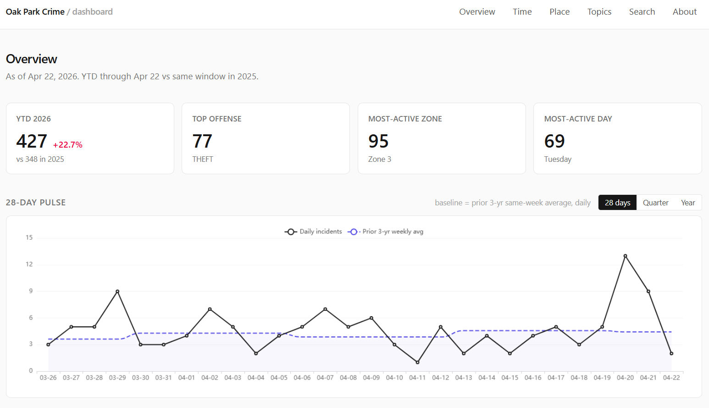
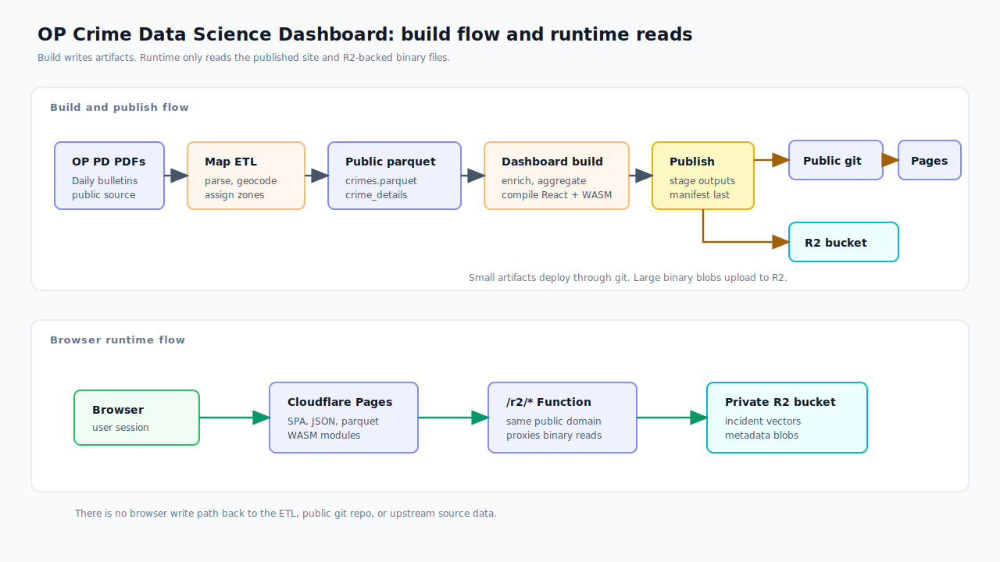
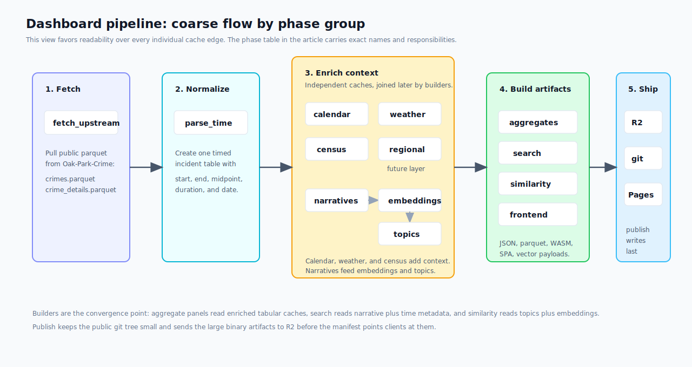
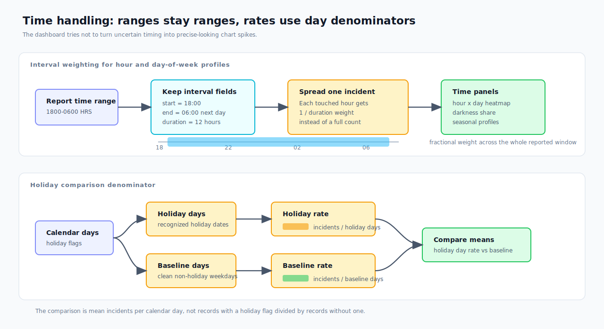
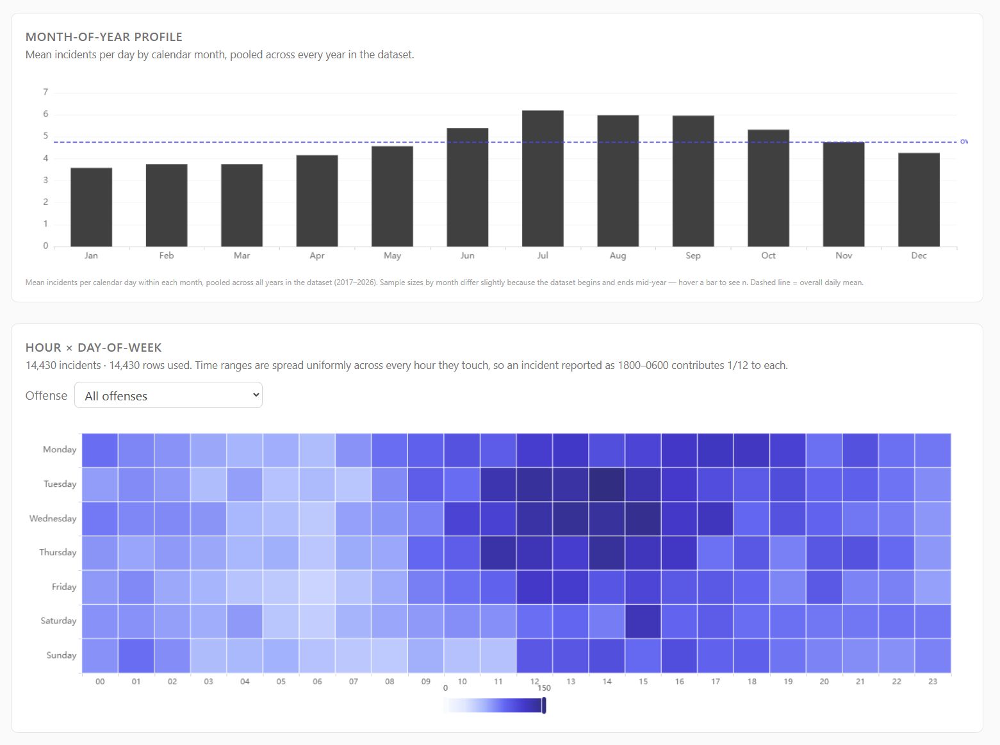
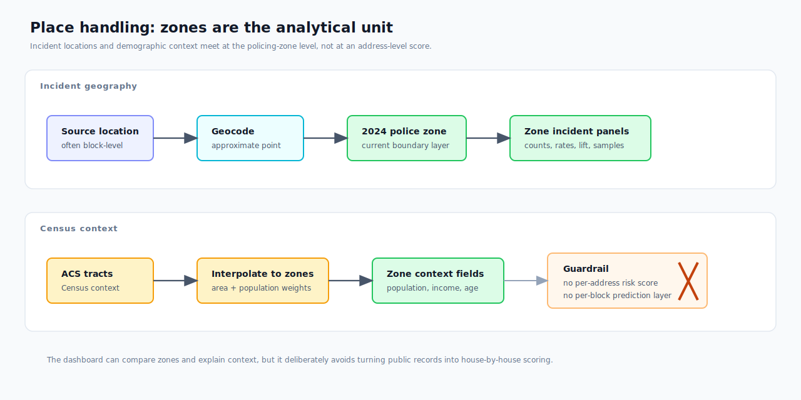
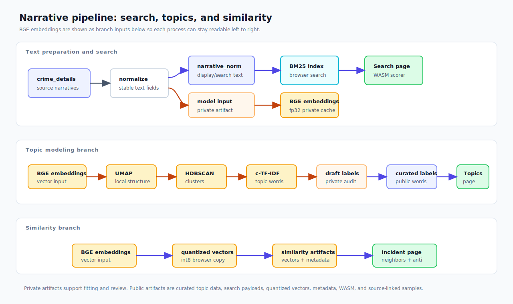
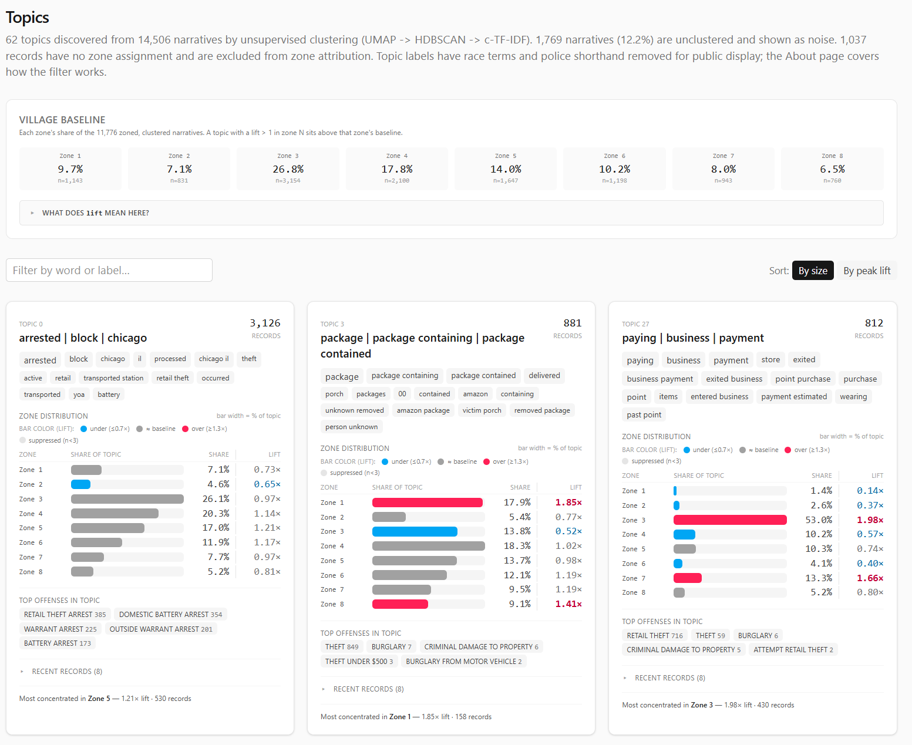
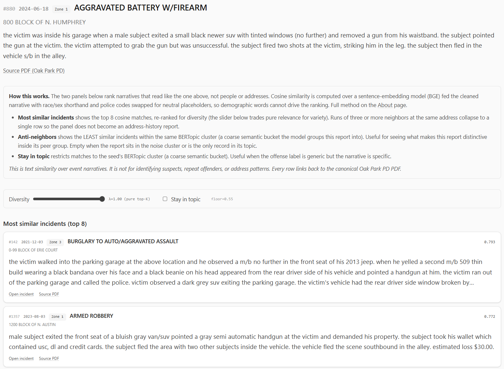

The crime map answered one kind of question: where did the Oak Park Police Department reports say incidents happened?

That was useful, but it was not the question I kept wanting to ask.

I live in Oak Park. That makes the map personally useful, but it also makes it easy to bring my own location bias into the interpretation. If I pan around near places I recognize, I am already filtering the data through memory, habit, and whatever I happened to notice last week.

For the next layer of the project, I wanted something colder.

Not "what do I feel like is happening near me?" but "what does the dataset say when I stop staring at my own neighborhood?" Soulless cold calculation, as much as a personal public-data project can provide it.

The live dashboard is here:

[Oak Park Crime Data Science Dashboard](https://opcrimeds.jesse-anderson.net/)

The map that feeds the broader project is here:

[Oak Park Crime Map](https://opcrime.jesse-anderson.net/)

Image post-disclaimer:

{fig-alt="Dashboard overview showing year-to-date totals and pulse windows."}

The map project and its pipeline are described in the companion post:

[Building an Oak Park Crime Map from Public PDFs](https://blog.jesse-anderson.net/posts/OP-Crime-Documentation/)

This post is about the next layer: the data science dashboard sitting on top of the map dataset.

[**Important disclaimer up front:**]{.underline} this is a demonstrative research project built from publicly available police activity reports. It is not affiliated with, endorsed by, or operated in partnership with the Oak Park Police Department, the Village of Oak Park, or any government agency. The official PDFs remain the authoritative source. This tool should not be used for legal, safety, investigative, operational, official, or unofficial decision-making.

## Motivation

The map made the records explorable. The dashboard is meant to make them analyzable.

Those are different jobs.

A map is good when the natural question starts with "where." Where are reports clustering? Where did this incident happen? Which zone is this block in? Can I click through to the original PDF?

A dashboard is better when the natural question starts with "compared with what?"

-   Are incidents up year-to-date compared with the same window last year?
-   Is one zone actually unusual, or does it just contain more total incidents?
-   Do certain offenses concentrate in civil darkness more than day length alone would predict?
-   Do holiday and weather patterns show anything interesting?
-   What kinds of themes emerge from the narratives when I stop manually choosing search terms?
-   Can I find similar records without hand-writing a hundred rules?

The original map was a public-record exploration tool. This dashboard is a descriptive analytics layer over the same public record stream.

That distinction matters because the dashboard is not trying to become an official crime system, a risk model, or a per-address scoring engine. It is a set of computed views over messy, delayed, human-entered public PDF data.

That sounds less exciting than "AI crime dashboard," but it is more honest.

## How This Fits With the Map

The dashboard does not scrape PDFs and it does not geocode addresses. That work belongs to the upstream crime-map pipeline.

The upstream project downloads Oak Park Police Department bulletins, parses complaint records, preserves source fields, geocodes where possible, assigns policing zones, and publishes structured data artifacts. The data science dashboard consumes those generated artifacts over HTTPS and builds its own derived views.

That separation is deliberate.

The map pipeline has to care about source fidelity. It needs to know whether a complaint number was weird, whether a date token was malformed, whether a record is outside Oak Park, and whether a geocoder placed something in the wrong municipality.

The dashboard has to care about analysis products. It needs to know how to normalize time ranges, how to build year-to-date comparisons, how to join weather and calendar data, how to compute topic clusters, how to rank search results, and how to ship those artifacts to a browser without a backend query server.

Those are related problems, but they should not be the same codebase.

{fig-alt="Architecture diagram showing Oak Park public PDFs flowing through the map ETL, public parquet artifacts, the private dashboard pipeline, staged web artifacts, R2 binaries, and the public Cloudflare Pages dashboard."}

The dashboard repository is private. The public boundary receives only compiled or generated artifacts: the minified web build, public JSON and parquet files, compiled WASM modules, a manifest, and large binary files in R2.

The private side keeps the Python pipeline, TypeScript source, Rust source, gazetteers, caches, model outputs that should not ship directly, and the operational glue. The public side gets the rendered product.

That split is partly operational. The public dashboard should be easy to visit; it does not need to expose every internal build script, cache file, or model artifact used to create it.

## The Current Shape

The current system has three main parts:

1.  A Python build pipeline that fetches upstream parquet files and creates enriched artifacts.
2.  A Vite, TypeScript, and React single-page app that renders the dashboard.
3.  Two Rust-to-WASM modules that handle heavier browser-side text and similarity work.

The last full build I am writing from used 14,531 upstream crime records. The exact number changes as new bulletins are published and the upstream project rebuilds.

The pipeline phases are intentionally boring:

| Phase                        | What it does                                                                            |
|------------------------------------|------------------------------------|
| `fetch_upstream`             | Downloads `crimes.parquet` and `crime_details.parquet` from the public map artifacts.   |
| `parse_time`                 | Parses OP PD time strings into start, end, midpoint, and duration fields.               |
| `enrich_calendar`            | Builds date-level holiday, weekend, school-calendar, daylight, and moon-context fields. |
| `enrich_weather`             | Joins daily weather observations from Chicago Midway.                                   |
| `enrich_narratives`          | Normalizes narratives, scans curated keyword lists, and creates embedding-safe text.    |
| `enrich_embeddings`          | Encodes narratives with a sentence-embedding model and quantizes the vectors.           |
| `enrich_topics`              | Builds unsupervised narrative topics using UMAP, HDBSCAN, and c-TF-IDF.                 |
| `enrich_census`              | Interpolates Census ACS context from tracts to policing zones.                          |
| `build_aggregates`           | Produces the JSON panels used by Overview, Time, Place, Topics, and Offense pages.      |
| `build_search_index`         | Builds the BM25 keyword-search index and public document payload.                       |
| `build_similarity_aggregate` | Packs quantized vectors and incident metadata for the WASM similarity engine.           |
| `build_frontend`             | Compiles Rust WASM and builds the React app.                                            |
| `publish`                    | Uploads large binary artifacts to R2 and pushes the public web artifact tree.           |

There is also a regional enrichment phase stubbed for future work. It is intentionally not pretending to be complete yet.

{fig-alt="Pipeline diagram showing the dashboard build as grouped phases from upstream fetch through normalization, enrichment, browser artifacts, and publish."}

Most of the dashboard is not querying a database at runtime. It is reading precomputed JSON, parquet, and binary artifacts. That is not as glamorous as live querying, but it is a good fit here.

This is a static public dashboard. The expensive work happens before publication.

## Overview: What Changed Recently?

The Overview page is the front door. It gives the kind of high-level answer I wanted before I built any of this:

-   year-to-date incident count;
-   same-window comparison against the prior year;
-   most common YTD offenses;
-   most active zones;
-   most active day of week;
-   recent pulse windows over 28 days, 90 days, and 365 days;
-   a custom date-range comparison chart.

The point is not to make a dramatic claim. The point is to prevent my own attention from becoming the query engine.

If I happened to notice three incidents near me this week, that does not mean Oak Park is suddenly different. If a zone looks busy on a map, that might be because it is always busy. If a year-to-date number is up, it matters whether the comparison window is aligned.

The dashboard tries to keep those comparisons explicit.

Year-to-date comparisons use calendar-matched windows: January 1 through the current as-of date this year compared with January 1 through the same date in the prior year. That is not a statistical model. It is just a resident-readable comparison.

The custom comparison chart exists because fixed windows are often not enough. Sometimes the question is "what did this summer look like compared with last summer?" or "how does the period after this change compare with the same number of days before it?" The chart lets me line up arbitrary date ranges by day index instead of forcing every question into a single canned metric.

## Time: Ranges, Holidays, Darkness, and Weather

Time normalization was one of the first places where the data pushed back.

Police report times are not always point events. A theft may be reported as happening between 1800 and 0600 because the victim was away or asleep. If I reduce that to a midpoint, I pretend to know more than the report says. If I assign it entirely to the start hour, I create a fake spike.

So the dashboard keeps start, end, midpoint, and duration fields. Hour-of-day and day-of-week profiles spread each incident across every hour it touches. A 12-hour overnight range contributes one-twelfth of an incident to each hour, not one full incident to a single chosen hour.

That one choice makes the time panels less punchy but more honest.

{fig-alt="Time-method diagram showing reported time ranges being kept as intervals, spread fractionally across touched hours, and holiday comparisons using calendar-day denominators."}

The Time page currently includes:

-   long-run daily trends;
-   year-by-month heatmaps;
-   month-of-year profiles;
-   hour by day-of-week heatmaps;
-   calendar heatmaps;
-   holiday and weekend comparisons;
-   darkness-share panels by offense;
-   weather cohorts.

{fig-alt="Time tab screenshot showing month of year and hour x day of week."}

The holiday panel caused one of the more humbling bugs.

Holiday math looks easy: count incidents on holidays, divide by holiday days, compare with baseline days.

I still managed to get it wrong at one point.

The fix was not conceptually hard. The panel has to count holiday occurrences as days first, then compute mean incidents per holiday day, then compare against a clean non-holiday weekday baseline. It is not enough to grab records with a holiday flag and call that a holiday rate. The denominator matters.

Juneteenth added another wrinkle. The holiday API and calendar libraries do not necessarily treat every historical date as a holiday just because we now recognize it. Illinois did not start recognizing Juneteenth as a state holiday until Governor Pritzker signed it into law in 2021, so early-year counts behave differently depending on whether the question is "June 19 as a recurring date" or "recognized holiday under the law at that time."

That is exactly the kind of little detail that makes public-data dashboards less trivial than they look.

Weather is similar. The dashboard joins daily observations from Chicago Midway because it is close enough to Oak Park and has useful coverage. The weather panel does not say weather causes crime. It says that, in this dataset, days with certain weather conditions had different mean incident counts.

That difference matters. Descriptive association is not causation, and I do not want the interface to pretend otherwise.

## Place: Zones, Not Blocks

The Place page is where the dashboard gets closest to the map, but it still operates at policing-zone granularity.

It shows:

-   YTD incidents by zone;
-   lifetime incidents by zone;
-   YTD change by zone;
-   YTD incidents per 1,000 residents;
-   top offenses by zone;
-   distinctive offenses by lift;
-   hour and day-of-week profiles;
-   narrative signal shares;
-   Census-derived demographic context.

The choropleth, a word I learned while reading papers for this project, uses the April 2024 Oak Park policing-zone map. That means historical incidents are projected into current zone boundaries. That is a limitation, but it is an explicit one.

The demographic layer comes from Census ACS tract data, interpolated into policing zones. Count-like variables such as population and households are area-weighted. Rate-like variables such as income, age, and percentage fields are population-weighted.

{fig-alt="Place-context diagram showing incident locations assigned to current policing zones, ACS tract context interpolated into zones, and a guardrail against per-address or per-block risk scores."}

This is not perfect. Tracts do not line up cleanly with policing zones, and areal interpolation assumes uniform distribution inside tracts. That assumption is not literally true. It is still a reasonable way to provide zone-level context without attaching demographic fields to individual incidents.

Per-capita rates are shown at the zone level. Smaller zones get a small-n badge instead of being hidden. I considered a stricter 5,000-resident display floor, but hiding zones below that threshold would make the interface feel more suspicious than transparent. Showing the number with a warning is the better compromise for this project.

The important guardrail is that the dashboard does not create per-address or per-block risk scores. That is not a feature waiting to be built. It is a feature I do not want.

## Narrative Signals: Useful, But Bounded

The upstream PDF parser gives the dashboard narrative text. That text is messy, but it is also where much of the interesting signal lives.

The first narrative layer is deliberately simple: curated keyword scans.

The pipeline scans for categories such as:

-   firearm terms;
-   vehicle modus operandi;
-   stolen items;
-   substances;
-   location types;
-   outcome flags.

These lists are not meant to be a universal crime ontology. They are a practical way to answer questions like "how often does this zone's narrative text mention unlocked vehicles?" or "which items appear most often in theft narratives?"

The keyword lists do not include suspect race or ethnicity mining. That is a design choice, not a technical limitation. The dashboard is about event patterns in public records, not building a suspect-descriptor search engine.

The narrative pipeline also creates a second text column for embeddings. The displayed narrative preserves the normalized source text. The embedding input replaces race and sex shorthand, demographic phrases, and police-internal codes with neutral placeholders before the model sees it.

That distinction is important:

-   Display text stays close to what the public source says.
-   Model input removes fields I do not want driving semantic similarity.

I do not think that makes the model morally pure or mathematically unbiased. It just removes some obvious garbage signal before asking the model to compare event descriptions.

## Topics: The Part I Like Most

The Topics page is the part of the dashboard I am happiest with.

It is also the part that forced me to learn the most.

The goal was to let the narratives tell me what kinds of recurring themes exist without manually writing every category in advance. A keyword list can find "catalytic converter" if I know to look for it. It will not discover the broader shape of package theft, bike theft, retail patterns, vehicle recoveries, or arrest-heavy clusters on its own.

The current topic pipeline looks like this:

1.  Encode each narrative with `BAAI/bge-large-en-v1.5`.
2.  Reduce the 1024-dimensional vectors with UMAP.
3.  Cluster the reduced vectors with HDBSCAN.
4.  Label clusters with c-TF-IDF terms.
5.  Filter public labels to remove race and police-shorthand terms.
6.  Build topic cards with size, words, zone distribution, lift, top offenses, and sample incidents.

{fig-alt="NLP pipeline diagram showing normalized narratives splitting into browser search, topic modeling, and similarity artifact branches."}

My first instinct was to try PCA for dimensionality reduction. PCA is familiar, linear, and easy to reason about. It also did not give me the neighborhood structure I wanted. The clusters felt smeared. The local semantic shape of the data was not coming through cleanly.

UMAP worked better, but it was not a magic switch. I had to tune it.

That was fun in the painful way. UMAP became one of those project detours where the technique stops being abstract because your lack of familiarity with it is suddenly blocking the thing you are trying to build.

The dashboard uses UMAP to reduce embeddings before HDBSCAN clusters them. HDBSCAN helps because it can label records as noise instead of forcing every narrative into a topic. Public police narratives have long tails, one-off events, sparse descriptions, and generic arrest language; forcing every row into a cluster would make the topic page look cleaner while making it less honest.

After clustering, c-TF-IDF labels each topic by finding terms that are common inside the cluster and relatively uncommon outside it. That produced useful labels, but it also exposed an ethical problem.

Some raw labels surfaced race or police shorthand because those terms appear in source narratives. On at least one topic, descriptor language ranked too highly for comfort. Publishing that as a topic label would let the model put identity terms in the headline of a crime theme.

So the topic pipeline keeps two versions:

-   raw topic words, retained privately as an audit trail;
-   public topic words, after a blocklist removes race and police-shorthand terms.

The cluster assignments do not change. Only the displayed labels change.

{fig-alt="Topics tab screenshot showing discovered narrative clusters, top words, zone lift, and sample records."}

This is where I am both enthusiastic and cautious.

The topic page is genuinely useful. It surfaces patterns I would not have seen as quickly with manual filtering. It helps turn thousands of narrative blurbs into a browsable shape.

It is also just a model.

Unless a model is rigorously validated for the thing you are using it for, it is another overhyped black box with nice-looking output. That does not mean it is useless. It means the interface should present it as exploratory structure, not as truth.

The dashboard tries to do that. Topics are themes, not official classifications. Labels are summaries, not legal findings. Noise is allowed. Samples link back to the source PDFs.

## Search: BM25 in the Browser

The Search page is intentionally less fancy than semantic search. It uses BM25, the standard keyword-ranking formula used by many search systems.

That is a good thing.

Sometimes the right tool is not another embedding. Sometimes I just want to type `catalytic converter`, `+porch package`, or `bicyc* -arrest` and see the relevant reports.

The pipeline builds a search index from the narratives:

-   lowercased tokenization;
-   stopword and blocklist removal;
-   document lengths;
-   term document frequencies;
-   flat postings lists;
-   BM25 constants `k1 = 1.2`, `b = 0.75`.

The browser loads that index and the document payload. Query parsing, wildcard expansion, boolean operators, and scoring run in Rust compiled to WASM.

That is not because JavaScript could not do it. The first version did. Rust/WASM also made the scoring path easier to test natively and kept the browser search module aligned with the heavier similarity engine.

The Search page also makes the blocklist visible through behavior. If a user searches for blocked race or police-shorthand terms, those words are not in the index. They return nothing because they were stripped at build time.

The Rust choice was not grand architecture. It was familiar, fast enough for the job, and easy to test without dragging the browser into every scoring check.

## Similar Incidents: Useful Neighbors, Not a Detective

The incident page is where the embedding work becomes interactive.

From a search result, offense drill-down, or topic sample, a user can open an incident page. The page shows the seed record, then asks the similarity engine for related narratives.

The similarity engine uses the quantized sentence embeddings. It computes cosine similarity in the browser, applies a floor, re-ranks with MMR for diversity, and collapses runs of repeated same-location neighbors so one address does not dominate the panel.

There are two panels:

-   most similar incidents;
-   anti-neighbors, meaning incidents in the same broad topic that read least like the seed.

The second one is a little strange, but useful. Similar incidents show the obvious peer group. Anti-neighbors show what makes a record distinctive inside its topic.

{fig-alt="Incident page screenshot showing the seed narrative, similar incidents, and anti-neighbor panel."}

The vectors ship as signed 8-bit integers instead of full 32-bit floats. That reduces the browser payload from roughly 59 MB to about 15 MB for the current corpus.

I did not want to do that blindly. Quantization can quietly destroy nearest-neighbor rankings if the embedding space is tight enough. So I ran validation against the full corpus.

The short version: the int8 vectors preserve neighbor rankings well enough for this feature. Mean recall at useful K values stayed high, median recall was perfect, and cosine drift was small compared with the natural spread between related narratives.

That does not prove the embedding model understands crime reports in some deep way. It proves the compression step did not materially break the neighborhoods the model already produced.

Again: useful, bounded, not magic. Useful enough to support exploration; not strong enough to pretend that it is evidence by itself.

## Offense Drill-Downs

The offense pages are a middle ground between high-level dashboard panels and individual incidents.

For common offenses, the pipeline precomputes drill-down profiles:

-   lifetime count;
-   year-to-date count and change;
-   monthly history;
-   hour by day-of-week matrix;
-   zone distribution;
-   zone lift;
-   narrative signals;
-   recent samples with source PDF links.

This helps when the Overview page says "THEFT" or "RETAIL THEFT" is high but the next question is "what does that actually mean over time and place?"

Not every offense gets a page. Rare offenses are excluded from drill-down output because shipping a lot of tiny panels would create small-n noise and inflate the public payload. If a user wants rare records, Search is the better interface.

## Caching and Publication

The dashboard is published as a static application, but the static part is a little deceptive.

The build is doing real work:

-   Python writes JSON and parquet artifacts into `staging/git`.
-   Large binary files go into `staging/r2`.
-   Rust crates compile to WASM and are copied into the frontend bundle.
-   The Vite build produces a minified SPA.
-   R2 uploads happen before the public manifest is committed.

That last ordering matters.

The manifest tells the browser where the large binary artifacts live. If the public manifest updates before R2 has the corresponding files, the site can point users at missing blobs. Uploading R2 first and committing the manifest last means interruption tends to leave the previous public build consistent.

The browser-side R2 path goes through a Cloudflare Pages Function. The R2 bucket stays private; the function streams allowed files at `/r2/<key>`. In development, Vite serves the local `staging/r2` directory at the same path so the frontend code does not need a separate local mode.

This is the sort of plumbing that is not very visible in a screenshot but makes the project feel like an application instead of a pile of scripts.

## What Improved

The dashboard changed the project from a map of records into a set of comparisons.

That matters most for bias. The map is still useful, but it naturally pulls my attention toward places I recognize. The dashboard pushes the work toward totals, deltas, baselines, zones, topics, and time windows.

It also gives each question a better home. The map can stay focused on location and source records. Time, place, weather, calendar, narratives, topics, search, and similarity can become separate lenses instead of being crammed into one interface.

The public/private boundary is cleaner too. The private side can keep the heavier models, caches, Python tooling, and audit files. The public side can stay a static dashboard with generated artifacts and source links.

## Bugs and Lessons

The holiday bug is the one I keep thinking about because it was so ordinary: not a dramatic machine-learning failure, not a WASM issue, just simple math.

A lot of the bugs I ran into were the kind that make dashboards dangerous: everything looks polished, but the chart is quietly answering the wrong question.

I’d count records when I really needed days, and suddenly the holiday view was misleading. I’d treat a time range like a single point, and the hourly heatmap looked way more confident than it should. I’d deduplicate complaint numbers and accidentally drop real records from the map. I’d publish raw topic labels and realize the model was turning source bias into the headline.

That ended up being most of the hard work, not fixing huge, obvious failures. Catching the small assumptions that looked reasonable right up until they weren’t.

The UMAP work taught a different lesson. Sometimes the correct answer is not to force the familiar method to work. PCA was understandable and convenient. It did not produce the structure I wanted. Learning enough UMAP to tune the topic pipeline was the better path.

The same thing happened with embeddings. The exciting part is not "I used a model." Anyone can call a model. The useful part is deciding what text the model should see, what it should not see, how to validate the compressed output, and how to present the result without making it look more authoritative than it is.

## Remaining Caveats

The dashboard is still constrained by the source.

Oak Park publishes PDF bulletins. The upstream project turns those PDFs into structured artifacts, but the source remains delayed, human-entered, and sometimes messy. Incidents that are not reported to police do not appear. Corrections flow from the official source, not from my dashboard.

Geography is approximate. Many records are block-level. Some incidents legitimately occur outside Oak Park. Zone boundaries are current 2024 policing zones projected backward across the full dataset.

The analytical panels are descriptive. Weather ratios, holiday comparisons, topic clusters, and similar-incident results can suggest patterns worth inspecting, but they are not causal claims, official categories, suspect matching, address surveillance, or repeat-offender inference.

Those boundaries are the point. The dashboard is useful only if it stays descriptive, source-linked, and cautious about what public records can actually show.

## Future Work

The two future directions I care about most are anomaly detection and higher-order spatio-temporal clustering.

Anomaly detection would be the natural next analytical layer. The current dashboard can show that a count is up or down. A better version could ask whether a day, week, offense, or zone is unusual given the historical baseline, seasonality, weekday pattern, and known calendar effects.

That needs to be handled carefully. "Unusual" is not the same as "dangerous," and anomaly scoring can easily become a misleading alert machine if the UI is too dramatic.

The spatio-temporal work is more interesting. Right now, Place and Time are mostly separate tabs. Topics add narrative themes. The next layer would ask questions across all three:

-   Are certain narrative topics appearing in particular zones during particular time windows?
-   Do vehicle-related patterns cluster near transit corridors differently from package theft?
-   Are seasonal patterns different by zone and offense family?
-   Can we identify recurring public-record patterns without creating per-address risk products?

That is where the dashboard could become more than a collection of panels.

It also needs more care than a weekend build. The moment a dashboard starts surfacing "clusters," people can overread them. The right interface would need uncertainty, minimum counts, clear aggregation, and conservative language.

## Why This Matters

The crime map made public PDF records easier to explore. The dashboard makes them easier to compare.

That is the whole point.

Public records can be technically available and still operationally awkward. PDFs satisfy publication, but they do not naturally answer questions about trends, zones, weather, holidays, narrative themes, or similar reports. A map helps. A dashboard helps differently.

The current project is not a polished government product. It is a personal data engineering and data science project built around one local public-record stream.

But the pattern is general:

1.  Preserve the source.
2.  Build structured artifacts.
3.  Separate ingestion from analysis.
4.  Keep the public interface descriptive.
5.  Validate the parts that can be validated.
6.  Admit the parts that cannot.

The dashboard is useful because it does not rely on one big clever trick. It is mostly a pile of small, defensible decisions: parse time ranges honestly, count holiday days correctly, keep zones coarse, strip suspect descriptors from model input, label topics conservatively, quantize embeddings only after checking neighbor preservation, and link back to the official PDFs.

That is less flashy than pretending the model discovered the truth. But for public analytics, I'd like to think that is the better bargain: preserve the source, make the comparisons clear, validate what can be validated, and stay honest about the rest.

Thanks for reading,

Jesse