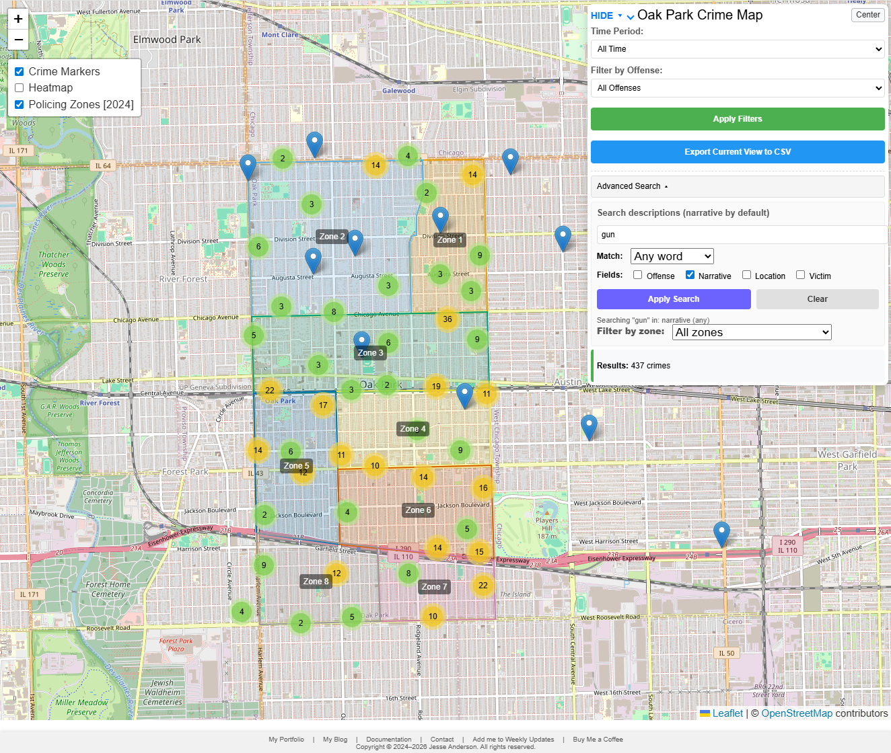
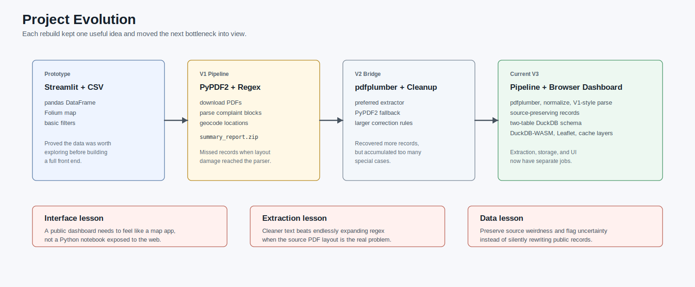
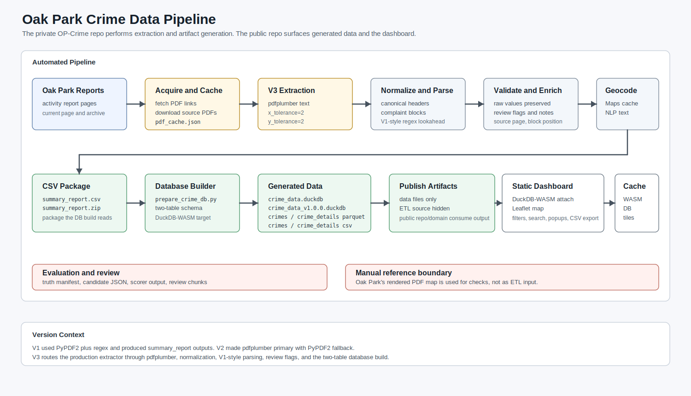
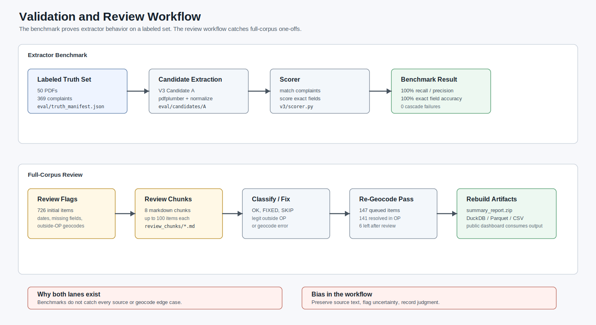
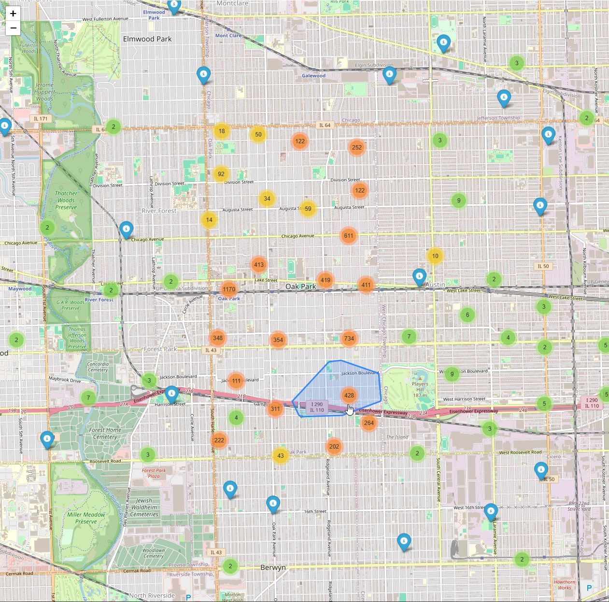

I originally built this because navigating Oak Park's crime reporting was slow. The activity reports were public, but the actual workflow was painful: open a PDF, read through it manually, cross-reference Oak Park's rendered PDF crime map, and repeat that process any time I wanted more context about what was happening near me.

A PDF is fine if you want to read one daily report. It is less fine if you want to ask what changed over the last 14 days, search narratives, map incidents, or compare one year against another without opening a pile of files by hand. Or printing them, highlighting relevant reports, then trying to pin everything on a printed Google Map..

It also seemed like a useful project to build while I was working through my Master's in Computer Science. It had enough real-world mess to be interesting: scraping, PDF parsing, regex, geocoding, browser performance, public disclaimers, and eventually DuckDB-WASM.

The project has been rebuilt several times. The first useful version was a Streamlit app sitting on top of a CSV. The next version became a private PDF scraper and parser using PyPDF2. DuckDB-WASM entered the public dashboard early because I already wanted the browser to do local analytical work instead of round-tripping every query through a backend(why would I pay hosting costs when duckDB is magical?).

That was for the most part the right instinct, but the rest of the stack had to catch up. After that I spent a while making the regular expressions and PDF parsing more tolerant, which helped in places and also taught me that I was fixing too many symptoms. The current version is the first one where the private pipeline and the public dashboard feel like they are solving the right problems separately: cleaner extraction, source-preserving records, a two-table schema, and enough caching that the map feels like an application rather than a static dump.

The live application is here:

[Oak Park Crime Map](https://opcrime.jesse-anderson.net)

Image post-Disclaimer:

{fig-alt="Image showing the Oak Park Crime Map with gun in the Search descriptions showing 437 crimes with the word \"gun\" across all zones + outside of Oak Park. Heatmap off for cleanliness."}

The public dashboard source and generated data are here:

[Oak-Park-Crime on GitHub](https://github.com/jesse-anderson/Oak-Park-Crime)

The ETL pipeline itself lives in a private GitHub repository. I only surface the public dashboard and the generated data artifacts.

The current public version is a static Leaflet application backed by DuckDB-WASM. The browser downloads a generated DuckDB database, attaches it read-only, and runs the filtering, searching, popup lookup, and CSV export work locally. The private pipeline does the slower work before publication: downloading Oak Park Police Department PDFs, extracting records, preserving source fields, geocoding locations, assigning zones where possible, and building the database artifacts the dashboard consumes.

[**Important disclaimer up front:**]{.underline} this is a demonstrative research project built from publicly available police activity reports. It is not affiliated with, endorsed by, or operated in partnership with the Oak Park Police Department, the Village of Oak Park, or any government agency. The official PDFs remain the authoritative source. This tool should not be used for legal, safety, investigative, operational, official, or unofficial decision-making.

## Motivation

Oak Park publishes police activity reports as PDFs. That checks the public record box, and I do not want to frame this as if publishing PDFs is some sort of bad-faith choice. PDFs are a normal government publication format and I am grateful that my local government publishes reports to inform the public. The issue is that they are awkward if the question is analytical instead of "what happened in this one report?" PDFs do not naturally answer questions like:

-   What types of offenses are most common over the last 14 days?
-   How does that compare with the last year?
-   Which incidents were inside Oak Park and which were reported elsewhere?
-   Can I search narratives for a word or phrase?
-   Can I click from a map point back to the original report context?

Those are normal data questions, but the source format makes them awkward. Police reports are also human-entered documents. They contain typos, inconsistent formatting, missing fields, and occasional layout problems. Any system built on top of them has to deal with that honestly.

That became one of the main design rules for the current version: preserve what the source says, validate what can be validated, and flag records that deserve review instead of silently rewriting them. If a report says `25-O3750` with a letter O, the pipeline should not confidently turn it into `25-03750` just because that looks more likely. If a date token says `30-JUN-148`, that should be visible as source weirdness, not quietly patched into whatever year I think the person who entered the record meant.

## How the Project Evolved

The short version is this:

| Stage                         | What it did                                                                                               | What changed next                                                                               |
|------------------------|------------------------|------------------------|
| Streamlit prototype           | Loaded a CSV, showed filters, rendered a Folium map, and proved the data was useful.                      | The public app needed to feel like a real browser map, not a Python dashboard.                  |
| PyPDF2 pipeline               | Downloaded PDFs, parsed complaint blocks, geocoded locations, and produced `summary_report.zip`.          | The parser missed records and PyPDF2 introduced layout damage.                                  |
| V2 regex/pdfplumber pass      | Made extraction more tolerant and got more usable records onto the map.                                   | It still relied on too many cleanup rules and lived as a bridge for longer than it should have. |
| Current V3 pipeline/dashboard | Uses cleaner extraction, source-preserving records, a two-table schema, DuckDB-WASM, and browser caching. | Current work is focused on performance, validation, and future email/LLM summarization.         |

{fig-alt="Project evolution timeline from Streamlit and PyPDF2 through the current V3 pipeline and browser dashboard."}

## The Initial Streamlit Version

The first version that felt useful was a Streamlit application. It loaded `data/summary_report.zip` into pandas, cached the DataFrame with `st.cache_data`, and rendered the result with Folium and MarkerCluster. There was a disclaimer gate, some basic filters, links back to the blog/portfolio, and early hooks for weekly update workflows.

For a prototype, that was good enough. Streamlit let me move quickly and it made the idea visible. I could prove that the PDF-derived data was worth looking at without first building a full front end.

It also put the ceiling in plain view. Streamlit is great when the audience is small and the workflow is analytical. It is less great as the public surface for a map-heavy application that should feel instant. The map was effectively being served through a Python app, the data was shaped as one large flat file, and the browser interaction was never going to feel like a purpose-built Leaflet page.

I also had a static Folium map phase, including cumulative HTML maps with all markers embedded into the page. That worked as a published artifact. It did not work as an exploratory tool. If the user only wants the last two weeks, there is no reason to make their browser pay for every marker in the history of the project. TLDR; It was painfully slow, but a great proof of concept.

That was the first split I should have made explicit: the private pipeline and the public dashboard are different products. One extracts and prepares data. The other lets people explore it.

The email side also started early. The email update list still exists, and users still get email updates when there is a bigger project change. I also experimented with weekly report summaries, but I stopped short of sending raw PDF parsing output as if it were a finished product. At the time, LLM parsing and summarization had too high of a hallucination rate for something that looked like a public crime report. A future feature is to bring that back with a better model and stronger validation. The programming pieces are mostly there; the future version is more likely to be a model swap and validation problem than a brand-new email system. Recent trials show that more recent LLMs don't insert nonsense as often as my first trials.

## The PyPDF2 Pipeline

The next major step was the private extraction pipeline. Instead of treating the CSV as the starting point, the project began downloading Oak Park activity report PDFs directly(including a record that they were downloaded to avoid abuse!), extracting text, parsing complaint blocks, geocoding locations, and writing structured output.

The first production parser used PyPDF2. It fetched PDF links from the current activity report page and archive, downloaded PDFs into a local cache, extracted page text with `PdfReader`, stripped headers and footers, split blocks by complaint number, pulled fields with regular expressions, geocoded locations through Google Maps, and wrote `summary_report.csv` / `summary_report.zip`.

That version was useful enough to build the first real dataset. It was also the version where the uncomfortable parser problems became obvious. My estimate, based on manual spot checks and comparing complaint counts against parser output, is that the initial parser could miss roughly 10-20% of complaints depending on the report and time period. That was not one clean bug. It was a mixture of fragile regex, PyPDF2 layout damage, and source formatting that varied just enough to break assumptions.

First, the input text was not stable. PyPDF2 often introduced layout artifacts in born-digital PDFs: broken words, unexpected spaces, field bleed across headers, page-break damage, and text ordering issues. Some of the failures looked like OCR problems at first, but they were not OCR problems. The PDFs were born digital. The text extraction layer was damaging the layout before the parser ever saw it.

Second, the data model deduplicated on complaint number. That sounds reasonable until you look at the reports. A complaint number is not always a unique event for map and analysis purposes. One case can include multiple recoveries, multiple offenses, or a theft in one report and a recovery in another. Keeping only the "most complete" row can silently remove real events.

That was the first major lesson: a crime report parser cannot treat complaint number as a primary key just because it looks like one. `18-1802` appearing three times for separate Hertz recoveries is not the same kind of problem as a duplicate row in a database import. It is a source event that happens to share a case number. I was happy that I had a base pipeline running, but not happy with how sporadic the PDF parsing could be.

## The Regex Optimization Pass

The next version tried to make the parser more robust by improving extraction rules. This was the V2 pass, and it was not a weekend experiment. Some version of this regex/pdfplumber approach existed for nearly two years before the V3 rewrite.

V2 added pdfplumber as a preferred extractor with PyPDF2 as fallback, larger artifact-correction dictionaries, more flexible field header matching, dataclasses for complaint records, confidence scoring, better date parsing, better location normalization, a separate V2 cache, and more detailed statistics.

I would not call that wasted work. If field headers are split, misspelled, or inconsistently spaced, better field patterns help. If dates contain `0CT` instead of `OCT`, date-specific cleanup helps. If locations use inconsistent abbreviations, location normalization helps.

But V2 also showed the limit of that strategy. The regular expressions were not the root problem. The root problem was the text layer. The parser was being asked to recover from extraction damage that should not have existed in the first place.

The trap is that every fix feels locally correct. Add another header variation. Add another date correction. Add another cleanup rule. After a while the parser starts looking sophisticated, but the sophistication is hiding the fact that the input text is still bad. In this case the answer was not a bigger regex. It was to get cleaner text before regex entered the conversation.

That said, the V2 period was still important. It got more records onto the map and reduced a lot of the random spaces, broken headers, and other nonsense that made earlier output unreliable. The mistake would be pretending it was the final architecture when there were plenty of more one off hurdles to overcome.

## The Current Architecture

The current system separates the project into two parts: a private ingestion pipeline and a public browser dashboard.

The private pipeline downloads and caches source PDFs, extracts complaint records, preserves source values, geocodes locations, assigns Oak Park policing zones where possible, builds the database artifacts, and publishes the files the dashboard consumes.

The public dashboard loads those artifacts in the browser, filters by time period/offense/search/zone, renders markers and heatmap layers, lazy-loads details when a user opens a popup, exports the current view, and caches the expensive pieces so repeat visits are not punished.

The browser should not parse PDFs. The private pipeline should not care how Leaflet pans. Once those concerns were separated, both sides became easier to optimize.

{fig-alt="Architecture diagram showing public Oak Park PDFs flowing through a private ETL pipeline into generated database artifacts consumed by the public dashboard."}

## Extraction: Fixing the Input Instead of Chasing Symptoms

The current extraction pipeline uses pdfplumber and a normalization layer before field parsing. The important design change was not simply "use pdfplumber." It was the realization that the old V1 parser strategy was mostly sound when the input text was clean.

The current parser follows a deliberately boring pattern:

1.  Extract text from the PDF with pdfplumber using tight layout tolerances.
2.  Normalize the text into canonical field headers.
3.  Split the document into complaint blocks.
4.  For each field, search from the field header until the next known field header.
5.  Return the first match.

In simplified form, the useful idea is:

``` python
pattern = field_header + r"\s*(.+?)(?=" + "|".join(all_headers) + r"|$)"
match = re.search(pattern, complaint_block, re.DOTALL | re.IGNORECASE)
```

The important part is not the exact spelling of that expression. It is the lookahead against every known field header. Each field is allowed to consume text until the next real field begins.

That "first match" behavior is important. It prevents narrative text that happens to contain words like `LOCATION` from being mistaken for the real field header, because the real field appears earlier in the block.

The evaluation work made the improvement measurable. A hand-labeled truth set of 50 PDFs covering 369 complaints was used to score extraction. On that evaluation set, the current V3 pipeline reached:

| Metric                                                         | Current result on evaluation set |
|-------------------------------|----------------------------------------:|
| Complaint recall                                               |                             100% |
| Complaint precision                                            |                             100% |
| Field accuracy for offense/date/time/location/victim/narrative |                             100% |
| Cascade failures                                               |                                0 |

Those validation files live with the private ETL repository, not in the public dashboard repository. The public repo gets the generated data artifacts and the browser application. The private repo keeps the source PDFs, truth-set files, candidate outputs, scorer scripts, and manual review notes.

{fig-alt="Validation workflow with a private labeled truth set, candidate extraction, scorer output, review flags, review chunks, fixes, re-geocoding, and rebuild steps."}

That does not mean the source is now magically clean. It means the current extractor passed the labeled evaluation set, and then still needed the normal kind of manual checking that public-record data deserves. It is also a parser benchmark, not a completeness guarantee for the public dashboard. Oak Park controls what gets published and when it gets published, and there can be reporting delays or publication limits that no parser can recover from. I still keep a conservative 10 percent incompleteness buffer in the public framing, because that is the honest way to describe a derived dataset built from delayed public PDFs.

The primary change here was using a different PDF parsing library really. I was aware when I first got the project going years ago that the broken text chunks were a problem, but the product was usable so it was ok. It wasn't until I began exploring the data science aspect of the project that it became important to make sure the text was clean to feed into whatever nonsensical Machine Learning model is the flavor of the week. More on that in a future article, until then here's the link to that project: <https://opcrimeds.jesse-anderson.net/>

## Data Modeling: Preserving Real Records

The current database schema moved away from complaint-number uniqueness. That sounds like a small database detail, but it changed the behavior of the whole project.

In the older flat model, a single `crimes` table held everything: map fields, date fields, narrative text, victim text, source information, and coordinates. That was easy to understand, but it caused two problems:

1.  It encouraged deduplication by complaint number.
2.  It forced the browser to load narrative and victim text even when the user only needed map points.

The current schema uses two tables. The first table is what the map needs. The second table is what a person needs after they click a record.

`crimes` is the map layer:

-   `record_id`
-   `complaint_num`
-   `pdf_filename`
-   `pdf_url`
-   `block_position`
-   `offense`
-   `date`
-   `location`
-   `lat`
-   `long`
-   `zone_id`
-   `zone_name`
-   `year`
-   `month`
-   `day`
-   `date_str`

`crime_details` is the deferred detail layer:

-   `record_id`
-   `time`
-   `victim`
-   `narrative`
-   `date_raw`
-   `source_page`
-   `notes`

`record_id` is the primary key. `complaint_num` is indexed, but it is not treated as unique. A deterministic natural key, `pdf_filename` plus `block_position`, keeps records stable without collapsing legitimate duplicate complaint numbers.

That fixes several real cases:

| Pattern                                        | Old behavior             | Current behavior                |
|------------------------|------------------------|------------------------|
| Multiple recoveries under one complaint number | Kept one row             | Preserves every recovery record |
| Multiple offenses under one case               | Could drop one offense   | Preserves both offenses         |
| Theft and later recovery in different reports  | Could keep only one side | Preserves both source records   |

As of the April 27, 2026 build, the current database metadata reports 14,581 records in both `crimes` and `crime_details`. The generated artifacts in that build include:

{fig-alt="Two-table schema diagram showing the crimes map table joined to the crime_details table by record_id."}

| Artifact                   | Purpose                                                    |    Size |
|----------------------|----------------------|----------------------------:|
| `crime_data.duckdb`        | Browser-attached DuckDB database                           | 7.01 MB |
| `crime_data_v1.0.0.duckdb` | Legacy storage-version DuckDB build for WASM compatibility | 6.76 MB |
| `crimes.parquet`           | Lightweight map layer                                      | 0.58 MB |
| `crime_details.parquet`    | Deferred detail layer                                      | 1.60 MB |
| `crimes.csv`               | CSV backup of map layer                                    | 4.10 MB |
| `crime_details.csv`        | CSV backup of detail layer                                 | 3.80 MB |

The pipeline still emits multiple formats because they serve different roles. DuckDB is convenient for the current browser application. Parquet is the better transport shape for a future map-first load path. CSV remains useful because at some point you always want to open the thing in a normal tool and make sure it says what you think it says. I'd really rather not over optimize at this point. It works reasonably well and there's plenty of optimizations I could make in the future to keep me occupied.

The public repository also uses a split-license model: source code under MIT and data artifacts under Creative Commons Attribution 4.0 International. That split matches the project. The code should be easy to reuse as software, while the data should remain reusable with attribution and a clear disclaimer that it is not an official public-safety dataset. CC BY 4.0 is a good fit here because the goal is public-record transparency, not locking the generated dataset behind the project that produced it.

## Source Fidelity and Review Flags

The current extractor follows a "flag, don't fix" policy.

That means:

-   complaint numbers are not zero-padded;
-   letter/number substitutions are not silently corrected;
-   dates are validated, but suspicious dates are not rewritten;
-   source typos are preserved;
-   missing fields remain missing;
-   anomalies are surfaced through notes and review flags.

The practical reason is simple: I do not want the pipeline inventing data. That matters more than squeezing out a tiny number of ugly records.

For example, if a complaint number is printed with a letter `O`, the system should not silently decide that the police meant zero. If a PDF contains a strange date token, the system should flag it rather than infer a replacement from the report year. Those guesses might be right most of the time, but the cost of being wrong is that the system has created a record that never appeared in the source. I would rather have a review flag than a false sense of polish.

The current review categories include:

-   `date_year_drift`
-   `date_unparseable_token`
-   `missing_field`
-   `geocode_outside_oak_park`

Review flags do not block publication by themselves. Their job is to make uncertainty visible.

An example of a pass that generates review flags is below:

> Flagged for Review — 2026-04-27 12:01:14 Total flagged: 4 ================================================================================
>
> Complaint #: 26-01939
>
> Date: 1900-01-01
>
> Offense: UNLAWFUL POSSESSION OF A WEAPON BY FELON ARREST
>
> Location: 1100 BLOCK OF LAKE
>
> Lat/Long: 41.8889519, -87.80295470000002
>
> Source PDF: summary-report-22-april-2026.pdf
>
> Block Pos: 4
>
> Reasons: date_unparseable: no valid token in '0706 HRS.'
>
> ------------------------------------------------------------------------
>
> Complaint #: 25-03933
>
> Date: 2025-07-23
>
> Offense: BATTERY ARREST
>
> Location: 900 BLOCK OF W LAKE ST
>
> Lat/Long: 41.8859463, -87.65002659999999
>
> Source PDF: summary-report-23-24-july.pdf
>
> Block Pos: 6
>
> Reasons: geocode_outside_oak_park: (41.885946, -87.650027) for '900 BLOCK OF W LAKE ST'
>
> ------------------------------------------------------------------------
>
> Complaint #: 19- 4305
>
> Date: 2019-07-30
>
> Offense: AGGRAVATED BATTERY TO LAW ENFORCEMENT OFFICER ARREST
>
> Location: 1500 MAYBROOK DR. MAYWOOD IL
>
> Lat/Long: 41.8730197, -87.82649889999999
>
> Source PDF: 24_hour_summary_report_31_july_2019.pdf
>
> Block Pos: 2
>
> Reasons: geocode_outside_oak_park: (41.873020, -87.826499) for '1500 MAYBROOK DR. MAYWOOD IL'
>
> ------------------------------------------------------------------------
>
> Complaint #: 19-3747 Date: 2019-07-29
>
> Offense: BURGLARY ARREST
>
> Location: 1500 BLOCK OF S. MAYBROOK DRIVE, MAYWOOD
>
> Lat/Long: 41.8730197, -87.82649889999999
>
> Source PDF: 24_hour_summary_report_30_july_2019.pdf
>
> Block Pos: 2
>
> Reasons: geocode_outside_oak_park: (41.873020, -87.826499) for '1500 BLOCK OF S. MAYBROOK DRIVE, MAYWOOD'
>
> ------------------------------------------------------------------------

As you can see it is pretty easy to acknowledge several of these are valid. Maywood is outside of Oak Park. The date encoding as a time is another issue and the 900 W Block of Lake Street needs to be checked manually then likely added to the JSON file as a valid encoding alongside its true location in Oak Park. There is some manual work here and there as I encounter one off issues, but for the most part at this point in time nearly everything is automated.

## Bugs That Changed the Design

The current design is mostly a collection of lessons from bugs I did not want to keep solving one at a time.

The first class was source-format weirdness. A complaint number like `25-O3750` looks like a typo if you assume every character after the dash should be a digit. It may even be a typo in the original report. But if the pipeline turns that into `25-03750`, the output no longer matches the source. The current rule is to preserve it and flag it if needed.

The second class was date damage and date ambiguity. `30-JUN-148` is not a date I want a parser quietly repairing. The earlier instinct was to infer the year from the report filename or nearby context. The better answer is to validate the date, keep the raw token visible, and mark the record for review.

The third class was duplicate complaint numbers. `18-1802` showed up multiple times for separate Hertz vehicle recoveries. An ordinary deduplication rule would collapse that into one row. For a map, that is wrong. Those recoveries are separate records with separate locations, even if they share a complaint number.

The fourth class was geocoding. Some records legitimately point outside Oak Park: Chicago, Maywood, Cicero, Forest Park, and other surrounding places appear in the reports because incidents, arrests, recoveries, and related case activity do not always happen inside village boundaries. Other records are Oak Park addresses that a geocoder can place incorrectly, especially on border streets or ambiguous block descriptions. The review chunks split those cases apart: legitimate outside-Oak-Park records stay flagged as outside, while likely geocode errors can be queued for a re-geocode pass.

That audit work was chunked deliberately. My private `review_chunks/chunk_*.md` files walk through 726 flagged items: unparseable dates, year drift, missing fields, geocode-outside-Oak-Park flags, legitimate non-Oak-Park incidents, and likely geocode errors. Working through those flags removes many possible future issues, but it is also part of an ongoing audit workflow. It was miserable to get through them, but its one and done as each peculiar record adds a new rule or geocoding prevents future issues. Realistically, of the 726 items, maybe 50 or so were true narrative errors or some issue in geocoding. Most were outside of Oak Park getting flagged. 50/\~14000 = \<0.5% which is good enough for me.

## Browser Dashboard: DuckDB-WASM, Leaflet, and Caching

The public dashboard runs as a static web application. There is no server-side query API in the hot path. The page loads DuckDB-WASM, downloads the generated database file, attaches it read-only, and queries it directly in the browser. DuckDB-WASM was already the direction in the earlier public dashboard, so the current win was not "discover DuckDB." The win was making the data shape, runtime caching, and map rendering match that decision. This resulted in a browser application with a small analytical database sitting next to the UI.

The map is built with Leaflet. It has marker clusters for incidents, a heatmap layer, Oak Park policing zones, date and offense filters, text search, zone filtering, CSV export, and a center button to get back to Oak Park after panning away.

The current dashboard only loads map-level fields for normal browsing. Time, victim, and narrative live in `crime_details`, and are loaded when a user opens a popup. That changes the interaction model: the map query stays smaller, the browser does not hold every narrative string just to draw points, popup details are still available when the user asks for them, and exports can still join detail fields when needed. I did not notice all that much of a speed increase with this new design decision, but it was more logical so I kept it. The caching strategy was marginally more important, but actually clean data was the clear win, at least for me.

The public application also has a layered cache strategy(convoluted??). The dashboard has three different cold paths, and they differ in policy:

-   DuckDB-WASM runtime files are large, change rarely, and affect startup time.
-   The generated `.duckdb` file changes on the public data cadence.
-   OpenStreetMap tiles are small, numerous, and matter most while a user is panning or zooming.

Treating those as one generic cache would either keep stale data too long or throw away expensive runtime and tile work too early. I do not wish to anger the OpenStreetMaps developer who blesseth me with tiles. The current version splits them into separate browser caches with separate freshness rules.

Deployment is intentionally simple: static assets on a custom domain, fed by a custom ETL pipeline that publishes the generated data artifacts. Most of the interesting work happens before deployment or inside the browser after the page loads.

{fig-alt="Browser cache architecture showing separate service-worker handling for DuckDB runtime assets, DuckDB data files, OpenStreetMap tiles, bounded adjacent-tile look-ahead, and rendering buffers."}

The cache policy is intentionally explicit:

| Cache          | Contents                                                                  | Freshness rule                                                    | Behavior                                                                                              |
|------------------|------------------|------------------|------------------|
| DuckDB runtime | DuckDB ES module, worker, and WASM binary                                 | 365-day service-worker TTL, reinforced by static headers for WASM | Cache-first because these files are expensive and rarely change                                       |
| DuckDB data    | Generated `.duckdb` files                                                 | 11-hour TTL                                                       | Fresh cache returns immediately; stale cache tries network first and falls back only if refresh fails |
| Tile backbone  | OpenStreetMap tiles at zoom levels 9-13 inside the Oak Park cache radius  | 14-day TTL                                                        | Small orientation cache, bounded by geography                                                         |
| Tile hot cache | OpenStreetMap tiles at zoom levels 14-18 inside the Oak Park cache radius | 30-day TTL, capped at 5,000 entries                               | High-zoom browsing cache, LRU-trimmed around an observed 85 MB ceiling                                |

### Service Worker Routing

The service worker is the routing layer for the expensive repeat requests. It does not blindly cache every request. It classifies traffic into DuckDB runtime assets, DuckDB data files, and OpenStreetMap tile requests. Each class has its own cache name, TTL, and failure behavior.

Freshness is tracked with a `sw-cached-at` response header written by the service worker. That avoids treating every cached response as equally fresh. The cache can make a deliberate decision: return a fresh asset immediately, serve a stale tile while refreshing it in the background, or attempt a network refresh before falling back to stale data.

The page registers the service worker before DuckDB initialization. That matters because the WASM path is part of startup cost. If the runtime files are already in CacheStorage, the app can avoid paying the full DuckDB-WASM fetch cost on every repeat visit. The page also keeps a roughly 25-second ping running against the service worker, which reduces the chance that the next tile request pays a service-worker cold-start penalty during map movement. When the browser supports it, the page asks for persistent storage so the tile and data caches are less likely to be evicted under storage pressure.

### DuckDB Runtime Cache

DuckDB-WASM is not one file. The browser needs the ES module, the worker, and the WASM binary. Those runtime files are cached separately from the data with a long-lived policy because they change far less often than the crime records.

The runtime cache covers the local DuckDB assets used by the app, and the page has a CacheStorage-backed fallback for runtime URLs that need to be loaded as worker or WASM resources. In practice, that means the browser can reuse the runtime even when DuckDB initialization asks for those assets through a path that would otherwise bypass a simple static-file cache.

The hosting headers reinforce the same idea. The WASM binary is served with a long immutable cache policy, while the JavaScript wrapper files have a shorter static cache policy. The service-worker runtime cache gives the app another layer of control on top of normal HTTP cache behavior.

### DuckDB Data Cache

The generated `.duckdb` file is intentionally not cached like the runtime. The data changes twice per day, so the browser pins the data file for 11 hours. That is long enough to make same-day repeat visits fast, but short enough that the dashboard does not quietly hold a stale database across multiple public update cycles. 11 hours was arbitrary; I will likely shorten it to 8 hours, enough for a work day sitting down and observing the crimes of the week.

The failure mode matters. If the cached database is still fresh, it is returned directly. If it is stale, the service worker tries the network first. If the network refresh fails and a cached copy exists, the app can still open with the stale database instead of failing into a blank dashboard.

### Tile Cache

OpenStreetMap tiles are cached by a service worker, but only around Oak Park. The cache uses a 5-mile radius around Oak Park Village Hall so normal use gets faster while unrelated browsing is left alone. Requests outside that geography, outside the supported zoom bands, or outside the approved OSM hosts pass through normally.

There are two tile tiers. The backbone tier covers zoom levels 9 through 13. It is small, bounded by geometry, and exists so low-zoom orientation tiles are available quickly. The hot tier covers zoom levels 14 through 18, where normal street-level browsing happens.

The hot cache is capped at 5,000 entries, roughly an 85 MB ceiling in observed use. It is LRU-trimmed with lightweight in-memory touch tracking so the app does not need to write an IndexedDB record every time a tile is used. Cached tiles are returned immediately. If a cached tile is stale, the service worker refreshes it in the background instead of making the user wait on the refresh.

The service worker itself does not bulk download or seed tiles. It fills the cache from normal Leaflet requests and from a small adjacent-tile look-ahead that runs only after human map movement settles. That look-ahead stays at the current zoom, remains inside the Oak Park cache radius plus a small margin, and is intended to smooth normal interactive panning rather than create an offline tile archive.

I did notice some speed up with the tile cache and on desktop my experience is far better to quickly pan around and see what happened where.

### Panning and Rendering Work

The rendering work is separate from the data loading work, but it solves the same user-visible problem: blank blocks and stalls while moving the map. The dashboard now uses several browser-side optimizations to reduce pan and zoom friction:

-   desktop Leaflet `keepBuffer` is set to 8, while mobile stays lower;
-   marker cluster animation is disabled during bulk rebuilds;
-   the heatmap raster is buffered to the viewport plus 75 percent padding in each direction, so modest pans can translate an existing canvas instead of immediately rebuilding the whole heatmap;
-   the heatmap canvas gets a `willReadFrequently` hint because the plugin reads pixel data during pan and zoom work;
-   policing zones render on a larger padded canvas so they repaint less often;
-   after a one-second idle pause following map movement, the page requests a small outer ring of nearby tiles as short-range look-ahead;
-   late automatic `fitBounds` calls are suppressed once the user has moved the map.

These are memory-for-smoothness tradeoffs. The page can use more memory than the earlier version because it is keeping tile rings, buffered rasters, and cached runtime work available. That is acceptable here because the application is a map exploration tool. A slightly larger memory footprint is preferable to a map that visibly stalls every time the user pans across the neighborhood. I will gladly take 100-200 mb more memory for a much faster time to analysis. As a side note, I was launching myself around the world as I had inertia settings on which meant a slight pause in processing would make the engine think I was swiping at the speed of light. Fun time debugging that.

## What Improved

The most important improvement is reliability. V3 is not merely faster; it is less likely to lose or distort records, which matters more for this project than a flashy UI change.

Extraction improved because the pipeline stopped treating PyPDF2 layout damage as an OCR problem. The current pdfplumber plus normalization approach produces cleaner text, and the parser can stay simpler.

Data fidelity improved because duplicate complaint numbers are preserved instead of collapsed. That matters for recoveries, multi-offense cases, and events that appear across multiple reports. For some inexplicable reason in my head I thought that each crime got its own number even if it was a separate day, but related instance.

Browser performance improved because map rendering and detail display are now separate operations. The user can draw the map from the `crimes` layer and only pay for narratives when opening a specific record. That is a better fit for how people actually use the map: pan, zoom, filter, click a few records, and move on. I, on the other hand, type the most unhinged thing into the search bar for the narrative then see if I get a hit!

The database build now has a clear web target. DuckDB-WASM was already part of the direction, but the two-table design made that decision pay off more. The map no longer needs to load every narrative and victim field just to draw points, and Parquet gives the project a cleaner future transport format than a single flat CSV.

The performance notes from the V3 redesign show the direction:

| Metric                     | Previous flat layout | V3 split layout |           Change |
|---------------------|----------------:|----------------:|----------------:|
| Initial map data payload   |             2,020 KB |          445 KB |             -78% |
| Detail payload             |    Included up front |        Deferred | Loaded on demand |
| Full map load query        |              92.3 ms |         51.0 ms |             -45% |
| Detail lookup on pin click |               1.6 ms |          1.1 ms |             -31% |

Those numbers were measured locally on the generated DuckDB/Parquet artifacts. Real-world browser performance still depends on network, device, viewport size, and cache state, but the structural improvement is the important part: the browser no longer needs every field to render the first useful map.

## Remaining Caveats

The project is still constrained by the source.

The official reports are PDFs. They are not an API, and they are not guaranteed to have stable formatting forever. A future report template change could break assumptions that are currently valid. That is why the extraction pipeline has a truth set, review flags, and a bias toward preserving source text rather than rewriting it. Maybe a FOIA request for a csv of everything including pre 2018 data would be in the works if this project ever picks up traction. Writing these blog posts is like screaming into the void.

Geocoding is also imperfect. Police report locations are often block-level descriptions rather than exact addresses. Some incidents occur outside Oak Park. Some location strings are ambiguous. The system can assign coordinates and zones where possible, but a map point should not be read as a precise legal location. That is actually quite useful for me since that means we don't track individual crimes to addresses which is its own ethical conundrum.

The public dashboard is a demonstration interface. It is useful for exploration, discussion, and technical transparency. It is not an official public safety system, and I do not want the interface to imply otherwise. Thus the heavy handed disclaimer that likely dissuades most users from even viewing it!

## Why This Matters

This project is a small example of a larger data engineering problem: public records are often technically public but operationally hard to use.

A PDF archive satisfies publication requirements, but it does not make the data easy to search, compare, map, or audit. Turning those PDFs into a browser-based analytical tool required the unglamorous layers: acquisition, extraction, validation, geocoding, schema design, browser transport, map rendering, caching, and disclaimers. None of those pieces are individually exotic. The work is in getting them to stop fighting each other.

The current architecture is better because each layer now has a clear job.

The private pipeline turns messy public documents into structured artifacts without pretending the source is perfect. The public dashboard makes those artifacts explorable without requiring a backend query server. DuckDB-WASM makes local browser analytics practical. Leaflet makes the spatial interface familiar. The service worker makes repeat use fast enough to feel like an application rather than a static data dump.

The most useful lesson is that performance and correctness were connected. The same redesign that made the dashboard faster also made the data model more honest. Splitting map fields from detail fields reduced browser load. Replacing complaint-number deduplication with `record_id` preserved real events. Fixing PDF text extraction reduced parser complexity. Caching the runtime, tiles, and data improved repeat visits without changing the source of truth. Or I decided to dedicate more brain power in the search of correctness and performance naturally followed. Anyway..

What this project needed wasn't a bigger regex or some non zero cost server, but a cleaner pipeline. For me, this project is primarily data engineering in service of public record transparency. I wanted to make the records easier to explore, render any source limitations clearly visible, and clearly delineate where my tooling stands vs the official records. Again, this is my own project, not affiliated with any entity beyond myself as of Late April 2026.

If you've made it this far congrats! : )

The old app used to look like this:



Notice the lack of an overlay, the (i) records, no search functionality, and the fact that all the records were dumped at once. It is pretty nice to be able to have a before and after. Placed at the tail end since nobody cares how things used to look.

Thanks for reading,

Jesse