# Build Custom Excel Functions in Rust

The [previous article](https://blog.jesse-anderson.net/posts/linreg_core_XLL/) ended with a working XLL add-in built in pure Rust. No C compiler, no external SDK, no import library. Just Rust, talking directly to Excel's [C API](https://learn.microsoft.com/en-us/office/client-developer/excel/programming-with-the-c-api-in-excel). I was genuinely happy with how it turned out.

I rewrote everything across a few crates hoping for portability. Then I looked at the registration code.

Every function that an XLL exposes to Excel needs to be [registered](https://learn.microsoft.com/en-us/office/client-developer/excel/xlfregister-form-1) at load time: 10+ `XLOPER12` arguments per function, a character-per-type encoding string, category and help text, argument names. For linreg-core I wrote all of that by hand. It worked, but the gotchas added up. Naming mismatches between the export symbol and the registration name would silently fail. Return codes come back as integers, so you're checking `== 0` instead of matching on a proper error type. None of it was catastrophic, just the kind of friction that makes you not want to start a second project.

And that was the thing. I wanted to start more XLL projects. I wanted to test the limits of what Excel could do with Rust behind it. But every new add-in would mean copying the same boilerplate, hitting the same gotchas, and hand-writing the same registration calls all over again.

If you've used `wasm-bindgen`, you know the model I had in mind: annotate a Rust function, and let a proc macro generate the binding code. Tag a function with an attribute, and the tooling figures out the type encoding, the registration arguments, and the export symbols. That's what I set out to build.

The result is three crates. [`xll-rs`](https://crates.io/crates/xll-rs) implements the XLL runtime and build tooling in pure Rust, the same approach I used in linreg-core but packaged as a library. [`xllgen`](https://crates.io/crates/xllgen) is the proc macro that generates the ABI wrappers, type conversions, and registration metadata from annotated functions. [`xll-utils`](https://crates.io/crates/xll-utils) provides PE/COFF parsing and export verification for inspecting the built binaries. And there's a [`cargo-generate` template](https://github.com/jesse-anderson/xll-template) that wires it all together into a working project scaffold.

This tutorial walks through using that template. You write plain Rust functions, tag them with `#[xll_bindgen]`, build, and load the XLL into Excel. No registration strings. No boilerplate. About ten minutes from an empty directory to custom functions in a spreadsheet.

Let's build one.

## What we're building

The template generates a complete XLL add-in with five example functions across three categories:

| Category        | Function                       | What it does                                 |
|----------------------|----------------------|----------------------------|
| `finance_tools` | `FINANCE_TOOLS.ADD(a, b)`      | Scalar math, simplest possible pattern       |
| `finance_tools` | `FINANCE_TOOLS.MULTIPLY(a, b)` | Same pattern, different operation            |
| `Stats`         | `Stats.MEAN(A1:A10)`           | Takes a range, returns a scalar              |
| `Sys`           | `Sys.VERSION()`                | No arguments, returns a string               |
| `Sys`           | `Sys.NOW_MS()`                 | Volatile: recalculates on every sheet change |

The category names in the left column are what show up in Excel's Insert Function dialog. The function names are what you type in the formula bar.

These five functions cover most of the patterns you'll run into when writing your own: scalar in/out, range aggregation, string returns, and volatile recalculation. By the end of this tutorial you'll have all of them working in Excel, and you'll add a sixth from scratch.

## Prerequisites

XLLs are native Windows DLLs, so the toolchain matters more than usual.

-   **Rust** (stable, MSVC toolchain). If you don't have it yet, grab it from [rustup.rs](https://rustup.rs). You need the MSVC target. If you're starting fresh:

    ``` sh
    rustup toolchain install stable-x86_64-pc-windows-msvc
    ```

    If you already have stable Rust but on the GNU target, you'll need the MSVC linker first. Install the [Visual Studio Build Tools](https://visualstudio.microsoft.com/visual-cpp-build-tools/) (select the C++ workload), then switch your default toolchain:

    ``` sh
    rustup default stable-x86_64-pc-windows-msvc
    ```

-   **cargo-generate** (\>= 0.18.0). Install it with `cargo install cargo-generate`. The template uses conditional file inclusion, which landed in 0.18.0. Older versions will silently ignore it.

-   **Windows**. There is no cross-platform equivalent (as far as I know); the add-in runs inside Excel's process.

-   **Excel**. Any recent desktop version (2016, 2019, 2021, Microsoft 365). The C API we're targeting has been stable since Excel 2007.

## Scaffold the project

``` sh
cargo generate gh:jesse-anderson/xll-template --name finance-tools
```

cargo-generate will ask you two questions:

```         
Display name for the add-in (shown in Excel's Add-In Manager) [default: My Add-In]:
```

Type whatever you want users to see in Excel's Add-In Manager. For this tutorial, use `Finance Tools`.

```         
Include GitHub Actions CI workflow? [default: true]:
```

If `true`, the project includes a workflow that builds the XLL on push and attaches it to GitHub Releases when you tag a version. Say `true` for now; you can always delete the `.github` folder later.

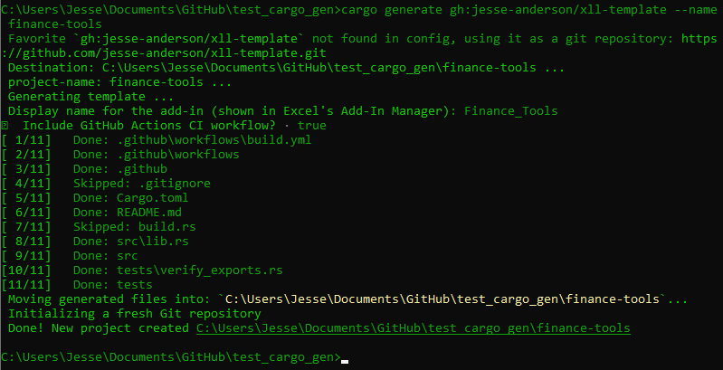{fig-alt="Screenshot of terminal showing cargo-generate output with the two prompts and the \"Done!\" message"}

Once it finishes, you get this:

```         
finance-tools/
├── Cargo.toml        # three dependencies: xll-rs, xllgen, xll-utils (dev)
├── build.rs          # one line: calls emit_xll() to copy the DLL to .xll
├── .gitignore
├── src/
│   └── lib.rs        # your functions live here
├── tests/
│   └── verify_exports.rs   # checks that the XLL has the right exports
├── .github/
│   └── workflows/
│       └── build.yml       # CI: build, test, release (if you said yes)
└── README.md
```

The important files are `src/lib.rs` (where you write functions), `build.rs` (one-liner that turns the DLL into an XLL), and `tests/verify_exports.rs` (catches missing or misnamed exports at test time).

`build.rs` is worth a quick look:

``` rust
fn main() {
    xll_rs::build::emit_xll();
}
```

That's it. `emit_xll()` tells Cargo to copy the compiled `.dll` to a `.xll` with the package name after the build finishes. For this project, that means `target/release/finance-tools.xll`.

## Build and verify

``` sh
cd finance-tools
cargo build --release
```

The first build pulls in dependencies and takes a bit. Subsequent builds are fast. When it finishes, you should have `target/release/finance-tools.xll`.

A word of caution from experience: when I first got the template working, cargo reported zero errors and the XLL loaded into Excel without complaint. But no functions appeared. The add-in was registering successfully, then silently failing during initialization. No error, no warning, just an empty category list. This is why the test suite exists. If the tests pass, the functions are there.

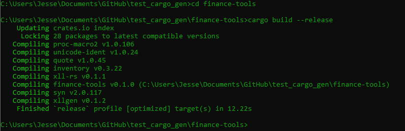{fig-alt="Screenshot of terminal showing successful cargo build --release output"}

Now run the tests:

``` sh
cargo test
```

The test suite in `verify_exports.rs` does three things:

1.  **Entry points.** Checks that the XLL exports `xlAutoOpen` (registers functions on load), `xlAutoClose` (cleanup on unload), `xlAutoFree12` (frees memory Excel is done with), and `xlAddInManagerInfo12` (provides the display name). Only `xlAutoOpen` is strictly required for loading, but missing the others means memory leaks or no name in the Add-In Manager.

2.  **User functions.** Checks that each function's generated wrapper is exported: `xl_add`, `xl_multiply`, `xl_stats_mean`, `xl_version`, `xl_now_ms`. These are the symbols xllgen creates from your annotated functions (`#[xll_bindgen]` on `fn add` produces export `xl_add`).

3.  **Registration names.** Scans the binary for the base names: `ADD`, `MULTIPLY`, `Stats.MEAN`, `Sys.VERSION`, `Sys.NOW_MS`. For dotted names like `Stats.MEAN`, this is exactly what you type in the formula bar. For `ADD` and `MULTIPLY`, the prefix `FINANCE_TOOLS` gets prepended at runtime during `xlAutoOpen`, so you'd type `FINANCE_TOOLS.ADD` in Excel. Either way, if the base name isn't in the binary, registration will fail silently, which is exactly the kind of naming mismatch I mentioned earlier.

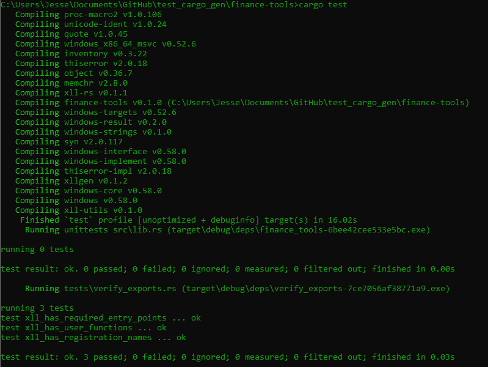{fig-alt="Screenshot of terminal showing cargo test with all 3 tests passing"}

If all three tests pass, the XLL is ready to load into Excel.

## Load into Excel

1.  Open Excel.
2.  Go to **File \> Options \> Add-ins**.
3.  At the bottom, make sure the dropdown says **Excel Add-ins**, then click **Go...**.
4.  Click **Browse...** and navigate to `target/release/finance-tools.xll`.
5.  Check the box next to it and click **OK**.

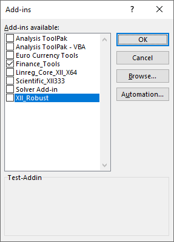{fig-alt="Screenshot of Excel Add-ins dialog with finance-tools.xll checked"}

If Excel asks whether you trust the add-in, click **Enable**. Excel remembers this selection, so the add-in will load automatically on future startups until you uncheck it.

To verify it worked, open the **Insert Function** dialog (click the *fx* button next to the formula bar, or press **Shift+F3**). You should see three new categories in the list: `finance_tools`, `Stats`, and `Sys`. (You may also see an `xllgen` category containing a diagnostic function `XLLGEN.REG_ERRORS`, which reports any registration failures. You can ignore it.)

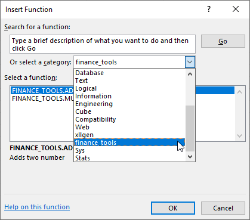{fig-alt="Screenshot of Insert Function dialog showing the three categories"}

**A note on reloading.** Excel seems to cache add-ins. If you're rebuilding and reloading to check changes, I've found that unchecking the add-in in the Add-ins dialog, then closing and reopening Excel before overwriting the old `.xll` works well. Trying to overwrite while Excel still has it loaded will fail since the file is locked.

## Try the built-in examples

Open a blank workbook and try each function. The template includes five, split across three categories.

### Math

Type into any cell:

```         
=FINANCE_TOOLS.ADD(2, 3)
```

You should get `5`. The prefix `FINANCE_TOOLS` comes from the crate name, uppercased. `ADD` is the base name from the `#[xll_bindgen]` attribute. The dot between them is added at registration time.

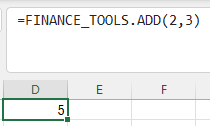{fig-alt="Addition"}

```         
=FINANCE_TOOLS.MULTIPLY(4, 5)
```

Returns `20`. Same pattern. These two functions take scalar `f64` arguments and return a scalar `f64`. No error handling, no `Result`, just a plain return value. This is the simplest function shape you can write.

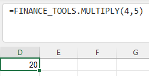{fig-alt="Multiply"}

### Stats

Put some numbers in cells A1 through A5 (say, `10`, `20`, `30`, `40`, `50`), then in another cell:

```         
=Stats.MEAN(A1:A5)
```

Returns `30`. This function takes a range, which xllgen converts from an `XLOPER12` multi into a `Vec<f64>` before your code sees it. You just write `fn stats_mean(values: Vec<f64>)` and the macro handles the rest.

Notice the name `Stats.MEAN` has a dot in it. Because the dot is already in the `name` attribute, it bypasses the crate prefix entirely. This is how you create custom namespaces that don't depend on the crate name.

The function returns `Result<f64, XllError>` instead of a bare `f64`. If you pass it an empty range, it returns an `XllError` with the message `"empty input"`, which Excel displays in the cell as an error string rather than silently producing garbage.

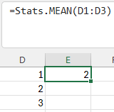{fig-alt="Mean"}

### Sys

```         
=Sys.VERSION()
```

Returns `0.1.0` (the version from `Cargo.toml`). No arguments, returns a `String`. The function body is just `env!("CARGO_PKG_VERSION").to_string()`, which bakes the version in at compile time.

```         
=Sys.NOW_MS()
```

Returns a large number: milliseconds since the UNIX epoch. Try editing any cell in the sheet and watch the value change. This function is marked `volatile`, which tells Excel to recalculate it on every sheet change. It's not marked `threadsafe` here, but the two aren't mutually exclusive. A function can be both volatile (recalculates on every change) and thread-safe (Excel can call it from multiple calculation threads). For `NOW_MS` it doesn't matter much, but for a volatile function doing heavier work, adding `threadsafe` lets Excel parallelize the calls.

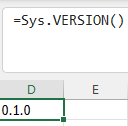{fig-alt="Version"}

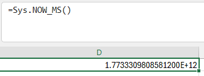{fig-alt="Now"}

## Write your first function

The template functions are there to show the patterns. Now add one of your own.

Open `src/lib.rs` and add a CAGR (Compound Annual Growth Rate) function. You can put it anywhere in the file, but below the existing functions and above the `xll_auto_open!` call is a natural spot:

``` rust
/// Compound Annual Growth Rate.
#[xll_bindgen(
    name = "FIN.CAGR",
    category = "Finance",
    args = "start_value, end_value, years",
    help = "Compound Annual Growth Rate",
    threadsafe
)]
pub fn cagr(start_value: f64, end_value: f64, years: f64) -> Result<f64, XllError> {
    if start_value <= 0.0 || end_value <= 0.0 {
        return Err(XllError::msg(XLLError::VALUE, "values must be positive"));
    }
    if years <= 0.0 {
        return Err(XllError::msg(XLLError::VALUE, "years must be positive"));
    }
    Ok((end_value / start_value).powf(1.0 / years) - 1.0)
}
```

That's the entire function. No registration code, no type encoding strings, no wrapper. The `#[xll_bindgen]` attribute handles all of it. Here's what each field does:

-   **`name = "FIN.CAGR"`** - The name users type in Excel. Because it contains a dot, it bypasses the crate prefix and registers exactly as `FIN.CAGR`. If you wrote `name = "CAGR"` instead, it would become `FINANCE_TOOLS.CAGR`.
-   **`category = "Finance"`** - Where this function appears in the Insert Function dialog. This creates a new category separate from the template's existing ones.
-   **`args = "start_value, end_value, years"`** - Argument names shown in Excel's Function Wizard when a user selects this function.
-   **`help = "Compound Annual Growth Rate"`** - Description text shown in the Function Wizard.
-   **`threadsafe`** - Tells Excel it can call this function from multiple calculation threads simultaneously. Safe here because the function is pure: no shared state, no side effects.

The function itself is plain Rust. Three `f64` inputs, validation with early returns, and a one-line formula. `XllError::msg` lets you attach a human-readable message to an Excel error code. If `start_value` is zero or negative, the cell shows `"values must be positive"` instead of a cryptic `#VALUE!`.

The `use` statements for `XllError` and `XLLError` are already at the top of `lib.rs` from the template, so you don't need to add any imports.

### Update the tests

The test suite in `verify_exports.rs` checks hardcoded lists of exports and registration names. It won't know about `cagr` unless you add it. Open `tests/verify_exports.rs` and add `"xl_cagr"` to the user functions test:

``` rust
let expected = &[
    "xl_add",
    "xl_multiply",
    "xl_stats_mean",
    "xl_version",
    "xl_now_ms",
    "xl_cagr",       // <-- add this
];
```

And `"FIN.CAGR"` to the registration names test:

``` rust
let expected_names: &[&str] = &[
    "ADD",
    "MULTIPLY",
    "Stats.MEAN",
    "Sys.VERSION",
    "Sys.NOW_MS",
    "FIN.CAGR",      // <-- add this
];
```

The export name `xl_cagr` comes from xllgen prepending `xl_` to your function name. The registration name `FIN.CAGR` is exactly what you put in the `name` attribute. If either is wrong, the tests will catch it before you waste time debugging in Excel.

## Rebuild and test

``` sh
cargo build --release
cargo test
```

All three tests should still pass, now covering the new function as well. If a test fails, the error message will tell you exactly which export or registration name is missing.

\*\*Note\*\*: If you experience a "linking with 'link.exe' failed: exit code: 1104"-esque error its because you are attempting to build and overwrite an xll that is in use. The solution is to close Excel and any other processes which may be using the xll in question!

Reload the add-in in Excel (uncheck, close Excel, rebuild, reopen, re-check) and try it:

```         
=FIN.CAGR(1000, 2000, 5)
```

Returns `0.1487` (approximately). That's 14.87% annual growth, which is what you'd expect for an investment that doubles in five years. You should also see a new `Finance` category in the Insert Function dialog with `FIN.CAGR` listed inside it.

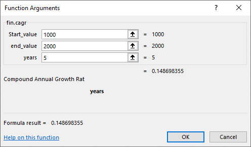{fig-alt="Screenshot showing =FIN.CAGR(1000, 2000, 5) returning ~0.1487 in Excel"}

This was the moment that clicked for me. After coercing Rust types to Excel's native representations by hand and writing registration code for every function, I could just type `=FIN.CAGR(...)` and it worked. It hit me that just about any engineering problem where I'd normally reach for a special Python script or some proprietary software, I could write some Rust once, write some tests, and never think about it again.

Try the error handling:

```         
=FIN.CAGR(-100, 2000, 5)
```

The cell should display `values must be positive` instead of a numeric result.

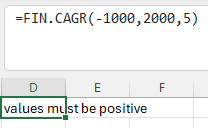{fig-alt="Error Message"}

The above shows that we can extend any sort of error message(I didn't include an explicit ERR:, but you can) and create multiple failure modes allowing us to show where in the chain of our calculations did we fail. Singular matrix? Division by zero? Model failure to converge? The possibilities are endless unfortunately.

That covers the full workflow: write a function, tag it, update the tests, build, load. The rest of this article is reference material, the patterns and options you'll reach for as your add-in grows.

## Function patterns reference

At some point you'll want to go beyond the template's examples. This is the section you'll come back to when you're staring at a function signature and wondering whether xllgen can handle it.

### Argument types

| Rust type       | Excel input      | Notes                                      |
|-----------------|------------------|--------------------------------------------|
| `f64`           | Number           | Also accepts integers from Excel (coerced) |
| `i32`           | Integer          | Truncates if Excel passes a float          |
| `bool`          | Boolean          | `TRUE`/`FALSE`, also accepts 0/1           |
| `String`        | Text             | Owned string, copied from XLOPER12         |
| `&str`          | Text             | Borrowed for the duration of the call      |
| `Vec<f64>`      | Range            | Flattened to a 1D vector                   |
| `Vec<Vec<f64>>` | Range            | 2D matrix, row-major by default            |
| `Option<T>`     | Any of the above | `None` if the argument is omitted          |

`Vec` and `Vec<Vec<>>` also work with `i32` and `bool` as the inner type.

### Return types

| Rust type             | Excel output   | Notes                                                                   |
|-------------------------|-----------------------------|------------------|
| `f64`                 | Number         |                                                                         |
| `i32`                 | Integer        |                                                                         |
| `bool`                | Boolean        |                                                                         |
| `String`              | Text           |                                                                         |
| `Vec<f64>`            | Spilled column | Returns a 1D array (n rows, 1 column)                                   |
| `Vec<Vec<f64>>`       | Spilled grid   | Returns a 2D array, row-major by default                                |
| `Result<T, XllError>` | T or error     | Error with message displays the string; without displays `#VALUE!` etc. |

`Vec` and `Vec<Vec<>>` returns also work with `i32` and `bool`. `Option<T>` is **not** supported as a return type.

### Common patterns

**Scalar in, scalar out (simplest)**

``` rust
#[xll_bindgen(name = "ADD", category = "Math", args = "a, b", help = "Adds two numbers", threadsafe)]
pub fn add(a: f64, b: f64) -> f64 {
    a + b
}
```

**Range in, scalar out (aggregation)**

``` rust
#[xll_bindgen(name = "Stats.MEAN", category = "Stats", args = "values", help = "Mean of a range", threadsafe)]
pub fn mean(values: Vec<f64>) -> Result<f64, XllError> {
    if values.is_empty() {
        return Err(XllError::msg(XLLError::VALUE, "empty input"));
    }
    Ok(values.iter().sum::<f64>() / values.len() as f64)
}
```

**Optional parameters**

``` rust
#[xll_bindgen(name = "Stats.WMEAN", category = "Stats", args = "values, weights", help = "Weighted mean", threadsafe)]
pub fn weighted_mean(values: Vec<f64>, weights: Option<Vec<f64>>) -> Result<f64, XllError> {
    if values.is_empty() {
        return Err(XllError::msg(XLLError::VALUE, "empty input"));
    }
    match weights {
        Some(w) => {
            let total_weight: f64 = w.iter().sum();
            let weighted_sum: f64 = values.iter().zip(w.iter()).map(|(v, w)| v * w).sum();
            Ok(weighted_sum / total_weight)
        }
        None => Ok(values.iter().sum::<f64>() / values.len() as f64),
    }
}
```

When a user calls `=Stats.WMEAN(A1:A5)` without the second argument, `weights` is `None`. If they call `=Stats.WMEAN(A1:A5, B1:B5)`, it's `Some(vec![...])`.

**Array return (spills into cells)**

``` rust
#[xll_bindgen(name = "SQUARES", category = "Math", args = "values", help = "Square each value", threadsafe)]
pub fn squares(values: Vec<f64>) -> Vec<f64> {
    values.iter().map(|v| v * v).collect()
}
```

This spills results into a column of cells. In Excel 365 and Excel 2021, spill happens automatically. Older versions require Ctrl+Shift+Enter to enter as an array formula.

**Matrix return**

``` rust
#[xll_bindgen(name = "IDENTITY", category = "Math", args = "n", help = "n x n identity matrix", threadsafe)]
pub fn identity(n: f64) -> Result<Vec<Vec<f64>>, XllError> {
    let n = n as usize;
    if n == 0 || n > 1000 {
        return Err(XllError::msg(XLLError::VALUE, "n must be 1-1000"));
    }
    let mut rows = vec![vec![0.0; n]; n];
    for i in 0..n {
        rows[i][i] = 1.0;
    }
    Ok(rows)
}
```

Returns a 2D grid that spills into an n-by-n block of cells. Row-major by default. If your data is column-major, add `layout = "col"` to the attribute:

``` rust
#[xll_bindgen(name = "MY_FUNC", layout = "col", threadsafe)]
```

**Volatile (recalculates on any change)**

``` rust
#[xll_bindgen(name = "Sys.NOW_MS", category = "Sys", help = "Milliseconds since UNIX epoch", volatile)]
pub fn now_ms() -> Result<f64, XllError> {
    let now = std::time::SystemTime::now()
        .duration_since(std::time::UNIX_EPOCH)
        .map_err(|_| XllError::new(XLLError::VALUE))?;
    Ok(now.as_secs_f64() * 1000.0)
}
```

**Error handling options**

xllgen supports three error types in `Result`:

``` rust
// XllError: error code + optional message string
pub fn f1(x: f64) -> Result<f64, XllError> {
    Err(XllError::msg(XLLError::VALUE, "must be positive"))  // cell shows "must be positive"
}

// XLLError: error code only, no message
pub fn f2(x: f64) -> Result<f64, XLLError> {
    Err(XLLError::VALUE)  // cell shows #VALUE!
}

// i32: raw error code
pub fn f3(x: f64) -> Result<f64, i32> {
    Err(xll_rs::types::XLERR_VALUE)  // cell shows #VALUE!
}
```

`XllError` is the most useful because it can carry a human-readable message. `XLLError` and `i32` return standard Excel error codes (`#VALUE!`, `#NUM!`, `#N/A`, etc.).

## Naming and organization

There are two things that control how a function's name appears in Excel: the **prefix** set in `xll_auto_open!`, and the **name** in each function's `#[xll_bindgen]` attribute. They interact in a specific way, and it's worth understanding the rules.

### The prefix

The `xll_auto_open!` macro at the bottom of `lib.rs` sets a global prefix:

``` rust
xllgen::xll_auto_open!(
    prefix = "FINANCE_TOOLS",
    addin = "Finance Tools"
);
```

The template generates this from the crate name, uppercased. You can set it to whatever you want.

If you omit the `prefix` argument entirely, it defaults to `env!("CARGO_PKG_NAME").to_ascii_uppercase()`. Note that `CARGO_PKG_NAME` preserves dashes (`finance-tools` -\> `FINANCE-TOOLS`), while the template uses `crate_name` which converts dashes to underscores (`FINANCE_TOOLS`). If your package name has dashes, keep the explicit prefix to avoid names like `FINANCE-TOOLS.ADD`.

### How names are resolved

The naming rules at registration time work like this:

1.  **`name` contains a dot** (e.g., `name = "FIN.CAGR"`): Used exactly as-is. The prefix is ignored. This is how you create custom namespaces.

2.  **`name` without a dot** (e.g., `name = "ADD"`): The prefix is prepended with a dot separator. `ADD` becomes `FINANCE_TOOLS.ADD`.

3.  **`name` omitted entirely**: The function name is uppercased and used as the base name, then the prefix is prepended. `pub fn my_func(...)` becomes `FINANCE_TOOLS.MY_FUNC`.

Rules 2 and 3 produce the same result when the name matches the uppercased function name, which is why the template's `name = "ADD"` on `fn add` is equivalent to omitting the name.

### Categories are independent

The `category` in `#[xll_bindgen]` controls where a function appears in the Insert Function dialog. It has nothing to do with the function name or prefix. You can put `FINANCE_TOOLS.ADD` in a category called `"Math"` and `FIN.CAGR` in a category called `"Finance"`. They're separate concepts.

After this tutorial, the Insert Function dialog for this add-in looks like:

```         
Insert Function dialog:
  [finance_tools]    FINANCE_TOOLS.ADD, FINANCE_TOOLS.MULTIPLY
  [Finance]          FIN.CAGR
  [Stats]            Stats.MEAN
  [Sys]              Sys.VERSION, Sys.NOW_MS
```

Four categories, two naming styles (prefixed and dotted custom namespace), all from the same XLL.

### Aliases

If you want a function to be callable by more than one name, xllgen supports `aliases`:

``` rust
#[xll_bindgen(
    name = "FIN.CAGR",
    aliases = ["CAGR", "COMPOUND_GROWTH"],
    category = "Finance",
    threadsafe
)]
pub fn cagr(...) -> Result<f64, XllError> { ... }
```

This registers the function three times: once as `FIN.CAGR`, once as `CAGR`, and once as `COMPOUND_GROWTH`. Aliases are used exactly as written, with no prefix applied.

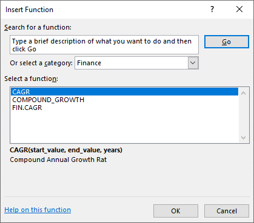{fig-alt="Aliases"}

## CI/CD

If you said yes to `include_ci` during project generation, the template created `.github/workflows/build.yml`. It does two things.

**On every push and PR to main**, the workflow:

1.  Checks out the code on a `windows-latest` runner
2.  Installs the stable Rust toolchain
3.  Builds in release mode (`cargo build --release`)
4.  Runs the test suite (`cargo test`)
5.  Uploads the `.xll` file as a build artifact

The artifact is available from the Actions tab in your GitHub repo. Anyone with access can download it.

**When you push a version tag**, the workflow also creates a GitHub Release with the XLL attached:

``` sh
git tag v0.1.0
git push origin v0.1.0
```

The release job triggers on tags matching `v*`, downloads the artifact from the build job, and creates a release with auto-generated release notes. Users can then download the XLL directly from the Releases page.

The workflow uses `actions/upload-artifact@v4` and `softprops/action-gh-release@v2` for artifact handling and release creation. Build caching is handled by `Swatinem/rust-cache@v2`, which speeds up subsequent runs significantly.

## Next steps

At this point you have a working XLL, a test suite that catches registration problems before they reach Excel, and CI that builds and publishes it. The interesting part is what you do with it.

**Add external crates.** The add-in is a normal Rust project. You can pull in anything from crates.io. `serde` and `serde_json` for parsing structured data, `reqwest` (with `blocking`) for HTTP calls from a cell formula, `nalgebra` or `ndarray` for linear algebra. The only constraint is that the final output is a Windows DLL, so anything that compiles for `x86_64-pc-windows-msvc` works.

**Look at the examples.** Both [`xll-rs`](https://github.com/jesse-anderson/xll-rs/tree/main/examples) and [`xllgen`](https://github.com/jesse-anderson/xllgen/tree/main/examples) have example projects. The xll-rs `scientific_xll` example shows a more substantial add-in. The xllgen examples cover error handling patterns, layout options, and robust function design.

**Read the previous article.** If you want to understand what's happening under the hood, the [linreg-core XLL article](https://blog.jesse-anderson.net/posts/linreg_core_XLL/) walks through building an XLL from scratch without the proc macro. It covers the XLOPER12 memory model, the registration protocol, and the ownership rules between Excel and the DLL. Useful context if you ever need to debug something at a lower level.

**Crate documentation:**

\- [`xll-rs`](https://crates.io/crates/xll-rs) - Runtime, types, build tooling

\- [`xllgen`](https://crates.io/crates/xllgen) - Proc macro, attribute reference

\- [`xll-utils`](https://crates.io/crates/xll-utils) - PE/COFF parsing, export verification

\- [Template repo](https://github.com/jesse-anderson/xll-template) - Source for the cargo-generate template

Thanks for taking the time to read this article. There are a few gaps in the implementation currently such as RTD and they will be worked out eventually. Currently the workflow is aimed moreso for engineers and I can't quite see them needing Excel's Real Time Data. There may be a short update to this article at some point in the future grabbing stock data, fetching data from an API, Machine Learning(definitely DBSCAN or OPTICS), and extending the template with something like nalgebra or similar. Right now I'm pretty happy with the result since I can generate an XLL that does all of the heavy lifting and audit it at compile time if I so choose. I'd like to also extend this template eventually to also generate a 32 and 64 bit dll at build time, but again, future work!

Jesse